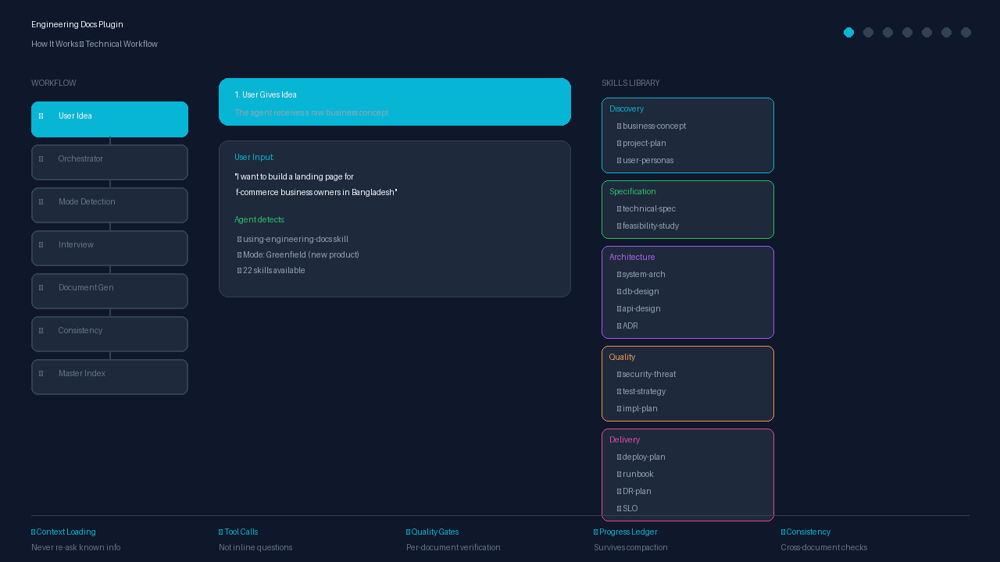
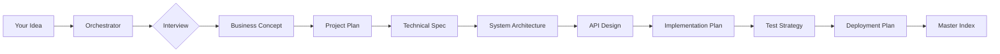

# Engineering Docs

> **22 composable, auto-triggering skills** that turn your coding agent into a principal engineer — from raw idea to production-ready documentation.

[](https://opensource.org/licenses/MIT)
[](https://www.npmjs.com/package/engineering-docs)
[](https://github.com/fattain-naime/engineering-docs)

---

## Why Engineering Docs?

Your coding agent is powerful, but it doesn't know your project's architecture, your users, or your constraints. Engineering Docs gives it **principal-level documentation skills** — so it can:

- **Turn raw ideas into complete blueprints** — business concept → technical spec → architecture → deployment plan
- **Ask the right questions** — tool-call interviews with 2-3 targeted questions per skill (no repeated questions)
- **Generate production-ready documents** — ISO/IEC/IEEE 29148, C4 Model, STRIDE, Google SRE standards
- **Work across 14+ agents** — Claude Code, Copilot, Cursor, Gemini CLI, Goose, Pi, and more

---

## How It Works



The plugin works through a structured workflow:

1. **User gives idea** → Orchestrator skill activates automatically
2. **Mode detection** → Greenfield (new) vs Brownfield (existing)
3. **Interview phase** → Tool-call questions with context loading
4. **Document generation** → Sequential generation with 22 specialized skills
5. **Consistency checks** → Cross-document verification
6. **Master index** → Complete blueprint ready for implementation

---

## Quickstart

```bash
npx engineering-docs
```

Or install for your specific agent:

| Agent | Install Command |
|:---|:---|
| **Claude Code** | `/plugin install engineering-docs@claude-plugins-official` |
| **Gemini CLI** | `gemini extensions install https://github.com/fattain-naime/engineering-docs` |
| **Cursor** | `/add-plugin engineering-docs` |
| **Goose** | `goose configure` → add extension |
| **Pi** | `pi install git:github.com/fattain-naime/engineering-docs` |
| **OpenCode** | `npx engineering-docs --opencode` |
| **Kilo Code** | Install from Kilo Code plugin marketplace |
| **Roo Code** | Install from Roo Code plugin marketplace |
| **Cline** | `npx engineering-docs --cline` |
| **Kimi Code** | `/plugins install https://github.com/fattain-naime/engineering-docs` |
| **Codex** | Install from Codex plugin marketplace |
| **Copilot CLI** | `npx engineering-docs --copilot` |
| **Factory Droid** | `npx engineering-docs --factory` |

See [Installation](#installation) for detailed instructions.

---

## How It Works



1. **Give it your idea** — "I want to build X"
2. **Answer 2-3 questions per skill** — via tool calls, not inline chat
3. **Review each document** — approve or request changes
4. **Get your blueprint** — complete, cross-consistent documentation set

**Smart features:**
- **Context loading** — reads prior documents before asking questions (never repeats)
- **Tool-call interviews** — clean input capture, no conversation pollution
- **Right-sizing** — skips documents that don't apply to your project
- **Cross-document consistency** — verifies entity names, roles, decisions match

---

## What's Inside

### Skills Library (22 Skills)

**Discovery & Planning**
| Skill | What It Produces |
|:---|:---|
| `using-engineering-docs` | Orchestrator — routes to all other skills automatically |
| `business-concept` | Problem, users, value proposition, monetization, constraints |
| `project-plan` | Scope, milestones, RACI, timeline, work breakdown |
| `user-personas-behavior` | User personas, JTBD, success metrics, analytics plan |

**Specification & Feasibility**
| Skill | What It Produces |
|:---|:---|
| `technical-specification` | SRS/TSD with EARS syntax, traceability matrix |
| `technical-feasibility-study` | Go/no-go recommendation with evidence |

**Architecture & Design**
| Skill | What It Produces |
|:---|:---|
| `system-architecture-document` | C4 diagrams, 4+1 views, tech stack, NFRs |
| `architecture-decision-record` | Immutable ADR log (MADR format) |
| `database-design-document` | ERD, schema, indexing, migration plan |
| `api-design-document` | REST/OpenAPI 3.1 contract, RFC 7807 errors |
| `admin-access-control-specification` | RBAC matrix, audit logging, break-glass |
| `technical-blueprint` | Google/Stripe-quality TDD per feature |
| `ux-flow-specification` | User journeys, screen flows, UI states |
| `design-system-specification` | Design tokens, components, accessibility |

**Quality & Risk**
| Skill | What It Produces |
|:---|:---|
| `security-threat-model` | STRIDE analysis, attack surface, mitigations |
| `test-strategy-document` | Testing pyramid, CI gates, coverage targets |
| `implementation-plan` | Dependency-ordered build sequence, phase gates |

**Delivery & Operations**
| Skill | What It Produces |
|:---|:---|
| `deployment-plan` | Release strategy, go/no-go gate, rollback |
| `slo-error-budget-document` | SLI/SLO targets, burn-rate alerts |
| `technical-runbook` | On-call operations manual (Google SRE) |
| `disaster-recovery-plan` | RTO/RPO, backup strategy, failover |
| `incident-postmortem` | Blameless RCA with Five Whys |

### Custom Agents (4 Agents)

| Agent | Purpose |
|:---|:---|
| `documentation-generator` | Generate comprehensive documentation for software projects |
| `architecture-reviewer` | Review system architecture for scalability, security, and maintainability |
| `api-designer` | Design RESTful APIs following best practices |
| `test-strategist` | Create comprehensive test strategies for software projects |

### Utility Scripts

| Script | Purpose |
|:---|:---|
| `generate-dependency-graph.js` | Mermaid dependency visualization |
| `validate-documents.js` | Document validation |
| `calculate-error-budget.js` | SLO error budget calculator |
| `generate-test-cases.js` | Test case generator from specs |
| `generate-ddl.js` | SQL DDL generator from schema |
| `check-consistency.js` | Cross-document consistency checker |

### MCP Integration

```bash
.mcp.json          # MCP server configuration
bin/validate.js    # Validation server (validate_document_set, check_consistency, generate_index)
```

### Hooks

```bash
hooks/hooks.json          # SessionStart hook configuration
hooks/check-progress.js   # Check for in-progress documentation
hooks/run-hook.cmd        # Windows compatibility
```

### Eval Framework

```bash
evals/evals.json           # Test cases for orchestrator and key skills
evals/README.md            # How to run evals
evals/test-prompts/        # Sample test prompts
```

### Plugin Structure (Claude Compatible)

```
engineering-docs/
├── .claude-plugin/
│   ├── plugin.json        # Plugin manifest
│   └── marketplace.json   # Marketplace manifest
├── skills/                # 22 skills (SKILL.md files)
├── agents/                # 4 custom agents
├── hooks/                 # Event handlers
├── .mcp.json              # MCP server configuration
├── bin/                   # Executable scripts (install.js, validate.js, test-skills.js)
├── scripts/               # Utility scripts + setup scripts
├── evals/                 # Test framework
└── integrations/          # Other agent platform configs
    ├── agents/            # Agent configs (AGENTS.md, CLAUDE.md, GEMINI.md)
    └── plugins/           # Plugin configs for 13+ platforms
```

**Claude Guidelines Compliance:**
- ✅ Components at plugin root (not inside `.claude-plugin/`)
- ✅ Skills in `skills/` directory with `SKILL.md`
- ✅ Agents in `agents/` directory with frontmatter
- ✅ Hooks in `hooks/hooks.json`
- ✅ MCP in `.mcp.json`
- ✅ Kebab-case naming
- ✅ Validation passes: `claude plugin validate .`

---

## Installation

### CLI Installer (Recommended)

```bash
npx engineering-docs
```

Automatically detects and copies the plugin to your agent's directory.

### Per-Agent Installation

#### Claude Code

```bash
# Official marketplace
/plugin install engineering-docs@claude-plugins-official

# Or register marketplace first
/plugin marketplace add fattain-naime/engineering-docs
/plugin install engineering-docs@engineering-docs
```

#### Gemini CLI

```bash
gemini extensions install https://github.com/fattain-naime/engineering-docs
```

Or clone manually:
```bash
git clone https://github.com/fattain-naime/engineering-docs.git ~/.gemini/config/plugins/engineering-docs
```

#### Cursor / Windsurf

```bash
npx engineering-docs --cursor
```

Extracts each skill to `.cursor/rules/engineering-docs-*.mdc`.

#### Goose

```bash
npx engineering-docs --goose
```

Or configure manually in `~/.config/goose/config.yaml`.

#### Pi

```bash
npx engineering-docs --pi
```

Or install from git:
```bash
pi install git:github.com/fattain-naime/engineering-docs
```

#### OpenCode

```bash
npx engineering-docs --opencode
```

#### Kilo Code

```bash
npx engineering-docs --kilo
```

Or install from Kilo Code plugin marketplace.

#### Codex / GitHub Copilot

```bash
npx engineering-docs --codex
```

#### Copilot CLI

```bash
npx engineering-docs --copilot
```

#### Cline

```bash
npx engineering-docs --cline
```

Copies `.clinerules` to your project root.

#### Factory Droid

```bash
npx engineering-docs --factory
```

#### Roo Code

```bash
npx engineering-docs --roo
```

#### Kimi Code

```bash
npx engineering-docs --kimi
```

Or install inside Kimi Code:
```text
/plugins install https://github.com/fattain-naime/engineering-docs
```

### Cross-Platform Scripts

```bash
# Windows (PowerShell)
pwsh scripts\setup.ps1
pwsh scripts\setup.ps1 -Target gemini
pwsh scripts\setup.ps1 -Target claude

# Linux / macOS (Bash)
chmod +x scripts/setup.sh
./scripts/setup.sh
./scripts/setup.sh --gemini
./scripts/setup.sh --claude
```

**Supported targets:** gemini, claude, local, cursor, kimi, codex, goose, pi, opencode, kilo, roo, cline, factory, copilot

### Safe-Write Behavior

All install methods use **safe-write** for agent config files:
- `AGENTS.md` — Created only if it doesn't exist
- `CLAUDE.md` — Created only if it doesn't exist
- `GEMINI.md` — Created only if it doesn't exist
- `COPILOT.md` — Created only if it doesn't exist
- `GOOSE.md` — Created only if it doesn't exist
- `PI.md` — Created only if it doesn't exist

**Your customizations are always preserved.**

---

## Multi-Agent Compatibility

| Platform | Manifest Format | Installation Path |
|:---|:---|:---|
| **Claude Code** | `.claude-plugin/plugin.json` | `~/.claude/plugins/engineering-docs/` |
| **Gemini CLI** | `integrations/plugins/gemini-extension.json` | `~/.gemini/config/plugins/engineering-docs/` |
| **Cursor / Windsurf** | `integrations/plugins/.cursor-plugin/plugin.json` | `./.cursor/rules/engineering-docs-*.mdc` |
| **Kimi Code** | `integrations/plugins/.kimi-plugin/plugin.json` | `~/.kimi-code/plugins/engineering-docs/` |
| **Codex** | `integrations/plugins/.codex-plugin/plugin.json` | `./.codex/engineering-docs/` |
| **OpenCode** | `integrations/plugins/.opencode/plugin.json` | `./.opencode/engineering-docs/` |
| **Goose** | `integrations/plugins/.goose/GOOSE.md` | `~/.config/goose/extensions/engineering-docs/` |
| **Pi** | `integrations/plugins/.pi/PI.md` | `~/.pi/packages/engineering-docs/` |
| **Kilo Code** | `integrations/plugins/.kilo-plugin/plugin.json` | `~/.kilo-code/plugins/engineering-docs/` |
| **Roo Code** | `integrations/plugins/.roo-plugin/plugin.json` | `~/.roo-code/plugins/engineering-docs/` |
| **Cline** | `integrations/plugins/.cline/.clinerules` | `./.clinerules` |
| **Factory Droid** | `integrations/plugins/.factory-plugin/plugin.json` | `~/.factory/plugins/engineering-docs/` |
| **Copilot CLI** | `integrations/plugins/.copilot/COPILOT.md` | `~/.copilot/plugins/engineering-docs/` |

---

## Testing

```bash
# Run plugin validation
claude plugin validate .

# Run skill tests
npm test

# Test MCP server
node bin/validate.js
```

---

## Philosophy

- **Systemic over Ad-hoc** — Rigorous, reproducible processes yield safer and cleaner software
- **Traceability** — Every requirement links to a business goal and a test case
- **Visual-First** — Complex architectures mapped with Git-trackable Mermaid diagrams
- **Operational Safety** — No feature is complete without deployment runsheet, monitoring, rollback
- **Blameless Learning** — Production failures are data points for system hardening

---

## Contributing

We welcome community skills! Please review [CONTRIBUTING.md](CONTRIBUTING.md) for guidelines.

---

## Community

- **GitHub**: [fattain-naime/engineering-docs](https://github.com/fattain-naime/engineering-docs)
- **Issues**: [Report bugs or request features](https://github.com/fattain-naime/engineering-docs/issues)

---

## Author

- **Fattain Naime** — [iamnaime.info.bd](https://iamnaime.info.bd)
- **Repository**: [https://github.com/fattain-naime/engineering-docs](https://github.com/fattain-naime/engineering-docs)

---

## License

MIT. See [LICENSE](LICENSE).
