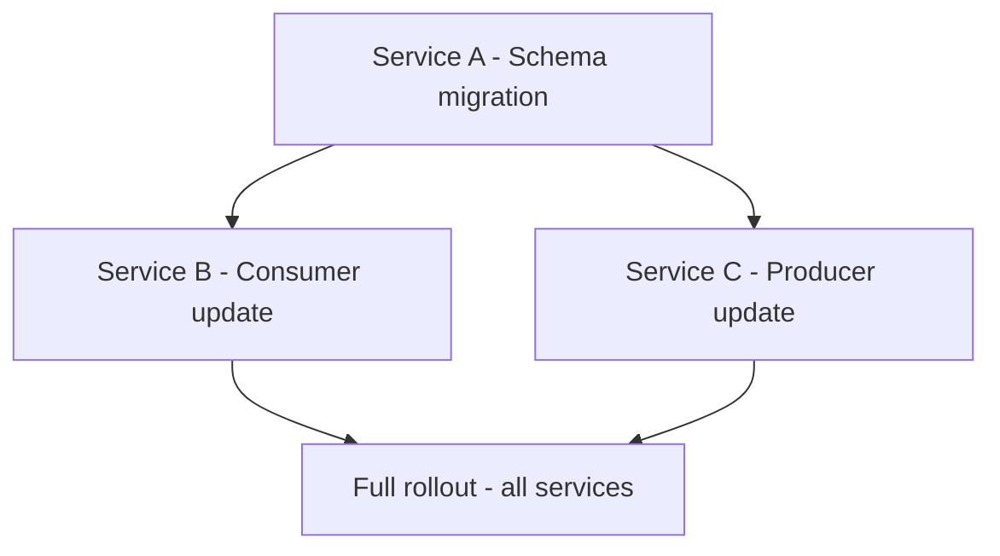
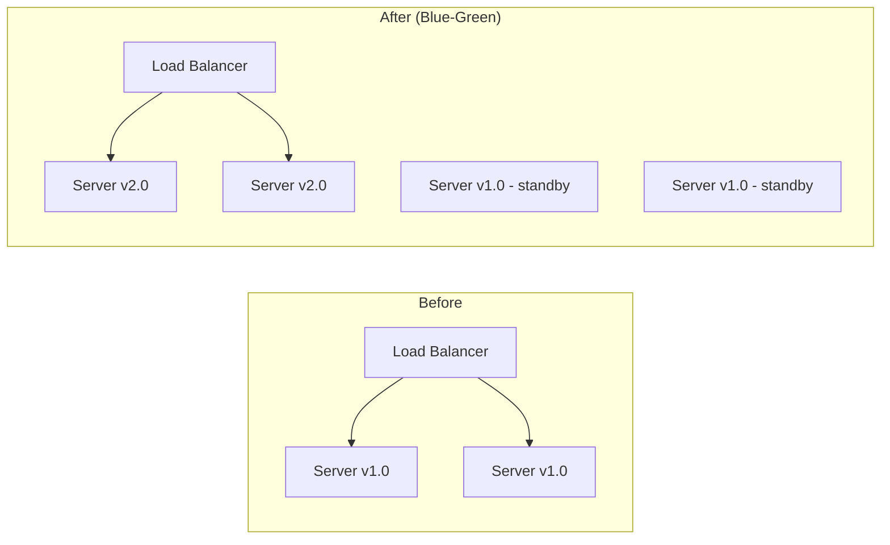

# Deployment Plan

**Release:** [Service Name] v[X.Y.Z]
**Document ID:** DEP-[IDENTIFIER]-[DATE]
**Status:** `Draft` | `Approved` | `Executing` | `Complete` | `Rolled Back`
**Deployment Date:** YYYY-MM-DD
**Deployment Window:** HH:MM - HH:MM [Timezone]
**Deployment Lead:** [Name]
**On-call Backup:** [Name]
**Approver:** [Name, Role]

---

## 1. Release Summary

### 1.1 What Is Being Deployed

| Item | Type | Description | Risk |
| :--- | :--- | :--- | :--- |
| [Change 1] | `Code` / `DB Migration` / `Config` / `Infra` | [Brief description] | `Low` / `Med` / `High` |
| [Change 2] | | | |

### 1.2 Motivation

[Why is this release going out? Link to tickets, incidents, or milestones it addresses.]

### 1.3 Deployment Freeze / Change Window

| Constraint | Status | Details |
| :--- | :--- | :--- |
| Scheduled freeze window active? | `Yes` / `No` | [e.g., End-of-quarter freeze: YYYY-MM-DD to YYYY-MM-DD] |
| Recent incident-triggered freeze? | `Yes` / `No` | [e.g., SEV-1 on YYYY-MM-DD, freeze until YYYY-MM-DD] |
| Freeze exception authorized? | `Yes` / `No` / `N/A` | [Authorized by: Name, Role, reason: ___] |
| Business event conflict? | `Yes` / `No` | [e.g., Holiday weekend, product launch, audit period] |

**Deployment proceeds only if:** No freeze is active, or a freeze exception has been explicitly authorized by [Name, Role].

### 1.4 Risk Assessment

**Overall Risk:** `Low` | `Medium` | `High` | `Critical`

| Risk Factor | Assessment | Mitigation |
| :--- | :--- | :--- |
| Database migrations | `None` / `Additive` / `Destructive` | [If destructive: backup taken at step X, tested on staging] |
| External dependencies | [None / List dependencies] | [Dependency risk mitigation] |
| Traffic impact | [Low: off-peak] / [Medium: peak hours] | [Deployment window avoids peak by X hours] |
| Rollback complexity | `Simple` / `Moderate` / `Complex` | [Rollback procedure at Section 7] |

### 1.5 Infrastructure Changes

> Complete this section if the deployment includes any Infrastructure-as-Code (Terraform, Pulumi, CloudFormation, CDK) or DNS/TLS changes.

| Change | IaC Tool | Resources Affected | Blast Radius | Rollback Method |
| :--- | :--- | :--- | :--- | :--- |
| [e.g., Add new ECS service] | [Terraform] | [ECS service, ALB target group, security group] | `Low` - new resources only | `terraform destroy` |
| [e.g., Modify RDS instance class] | [CloudFormation] | [RDS instance - will cause brief restart] | `Medium` - database restart | Revert CloudFormation stack |
| [e.g., DNS cutover to new ALB] | [Route53 / manual] | [DNS A/AAAA records] | `High` - traffic routing | Lower TTL 24h prior; revert records |

**IaC pre-deployment checklist:**
- [ ] `terraform plan` (or equivalent) output reviewed and matches expected changes
- [ ] No resource destruction that was not explicitly intended
- [ ] Remote state lock confirmed
- [ ] Configuration drift check: no drift detected / drift documented and accounted for
- [ ] DNS TTL lowered (if DNS changes are part of this deployment): lowered to [N seconds] at [HH:MM on YYYY-MM-DD]

### 1.6 Multi-Service Coordination

> Complete this section if the deployment spans multiple services.

**Deployment dependency graph:**



| Service | Deploy Order | Backward Compatible? | Rollback Dependency |
| :--- | :--- | :--- | :--- |
| [Service A] | `1st` | `Yes` / `No` | [Can rollback independently] |
| [Service B] | `2nd` | `Yes` / `No` | [Must roll back with Service A] |
| [Service C] | `3rd` | `Yes` / `No` | [Can rollback independently] |

**Compatibility window:** During the multi-service rollout, [describe the coexistence contract - e.g., "Service B must handle both v1 and v2 response formats from Service A until the rollout is complete."]

**Coordinated rollback plan:** If [Service A] is rolled back, [Service B and C] must also be rolled back to [version]. Execute rollback in reverse deployment order.

---

## 2. Deployment Strategy

**Strategy:** `Direct Deploy` | `Rolling` | `Blue-Green` | `Canary` | `Feature Flag`

### Rationale

[Why this strategy was chosen for this release]

### Strategy Diagram



### Canary Promotion Criteria (if Canary strategy)

> Define the exact metrics, thresholds, and promotion logic before the deployment begins.

**Canary stages:**

| Stage | Traffic % | Duration | Auto-Promote? | Auto-Rollback? |
| :--- | :--- | :--- | :--- | :--- |
| Initial canary | `[5%]` | `[15 min]` | `No - manual review` | `Yes - on threshold breach` |
| Expanded canary | `[25%]` | `[30 min]` | `No - manual review` | `Yes - on threshold breach` |
| Full rollout | `100%` | - | N/A | N/A |

**Comparison thresholds (canary vs. baseline):**

| Metric | Threshold | Tool | Rollback Trigger |
| :--- | :--- | :--- | :--- |
| Error rate delta | Canary must not exceed baseline by > `[0.5%]` | [Prometheus / Datadog] | Automatic |
| p99 latency delta | Canary p99 must not exceed baseline by > `[100ms]` | [Prometheus / Datadog] | Automatic |
| Business metric (e.g., payment success rate) | Canary must not drop below `[97%]` | [Custom dashboard] | Automatic |
| CPU / Memory | Canary pods must not exceed `[80%]` CPU or `[85%]` memory | [Kubernetes metrics / CloudWatch] | Manual review |

**Promotion authority:** [Automated if all thresholds pass / Requires sign-off from: Name, Role]

**Comparison tool / dashboard:** [URL or tool name for viewing canary vs. baseline side-by-side]

---

## 3. Prerequisites and Go/No-Go Checklist

> **ALL items must be checked before deployment begins.** If any item cannot be verified, deployment is blocked.

### Pre-Deployment Verification

- [ ] Release has been code-reviewed and approved by at least one senior engineer
- [ ] All automated tests pass on the release branch (CI green)
- [ ] Release has been deployed to staging and smoke-tested (date: YYYY-MM-DD, tester: [Name])
- [ ] Database backup verified: taken at [time] on YYYY-MM-DD, confirmed restorable
- [ ] Deployment runbook reviewed by deployment lead and backup
- [ ] Rollback procedure reviewed and tested on staging
- [ ] On-call engineer confirmed available and briefed for the deployment window
- [ ] Monitoring dashboards confirmed accessible
- [ ] Customer / external communications sent (if applicable): [Y/N]
- [ ] Feature flags created and set to `OFF` for any features using flag-based release: [List flags]
- [ ] [Environment-specific prerequisite]

### Go/No-Go Decision

**Deployment proceeds ONLY if all items above are checked.**

| Decision | Authorized By | Time |
| :--- | :--- | :--- |
| `GO` / `NO-GO` | [Deployment Lead name] | HH:MM |

---

## 4. Environment Specifications

### Production Environment

| Component | Spec | Count |
| :--- | :--- | :--- |
| Web servers | [OS, PHP version, Nginx version] | [N] |
| Database | [MySQL version, instance type] | [1 primary + N replicas] |
| Cache / Queue | [Redis version] | [N] |
| Load balancer | [Type] | [N] |

### Deployment Pipeline

```
[Git Tag / Release] → [CI/CD build + test] → [Artifact staging] → [Deploy to production] → [Smoke test] → [Done]
```

**CI/CD System:** [GitHub Actions / Jenkins / GitLab CI / Manual]
**Deployment Tool:** [Deployer / Capistrano / kubectl / Ansible / Custom script]

---

## 5. Execution Runsheet

> Step-by-step execution. Each step must be completed and confirmed before the next begins. Check each box as you execute.

### 5.1 Pre-Deployment (T-30 minutes)

- [ ] **5.1.1** Confirm deployment window: notify `#engineering-ops` channel: "Beginning deployment of [Release] at [time]"
- [ ] **5.1.2** Confirm production is healthy: check monitoring dashboard. Current error rate: `___%`, p99 latency: `___ms`.
- [ ] **5.1.3** Take database backup:
  ```bash
  # Record backup ID or confirm automated backup completed
  # Backup location: [path / S3 bucket]
  # Backup verified: [Y/N]
  ```
- [ ] **5.1.4** Confirm all feature flags are in correct state for deployment:
  | Flag | Required State | Actual State |
  | :--- | :--- | :--- |
  | `[flag_name]` | `OFF` | ___ |

---

### 5.2 Database Migrations (if applicable)

> Run migrations FIRST, before deploying new application code, if migrations are backward-compatible with the current running code.

- [ ] **5.2.1** SSH to migration host or run via deployment pipeline:
  ```bash
  # Run migration
  php artisan migrate --step   # Or equivalent for your stack
  # Or:
  mysql -u [user] -p [database] < migrations/20260709_add_webhook_tables.sql
  ```
- [ ] **5.2.2** Verify migrations applied:
  ```sql
  SHOW TABLES;
  -- Confirm new tables/columns exist
  -- Confirm row counts are as expected
  ```
- [ ] **5.2.3** Verify application still functioning with old code + new schema (30-second smoke test)

---

### 5.3 Application Deployment

- [ ] **5.3.1** Pull new release to staging directory:
  ```bash
  git fetch origin
  git checkout v[X.Y.Z]
  # Or: deploy via pipeline artifact
  ```
- [ ] **5.3.2** Install / update dependencies:
  ```bash
  composer install --no-dev --optimize-autoloader
  npm ci && npm run build  # If frontend assets
  ```
- [ ] **5.3.3** Clear and warm caches:
  ```bash
  php artisan cache:clear
  php artisan config:cache
  php artisan route:cache
  php artisan view:cache
  ```
- [ ] **5.3.4** Switch webroot symlink (zero-downtime swap):
  ```bash
  ln -sfn /var/www/releases/v[X.Y.Z] /var/www/current
  ```
- [ ] **5.3.5** Reload PHP-FPM gracefully:
  ```bash
  sudo systemctl reload php8.3-fpm
  ```

---

### 5.3b Container / Orchestration Deployment (if applicable)

> Complete this section instead of 5.3.1-5.3.5 if deploying to Kubernetes, ECS, or another container orchestrator.

**Container image:** `[registry/image:tag]` (immutable tag: `sha-abc1234` or `v2.4.0` - never `latest`)

#### Kubernetes Deployment

- [ ] **5.3b.1** Verify the new image exists and is pullable:
  ```bash
  docker pull [registry/image:tag]
  # Or: crictl pull [registry/image:tag]
  ```
- [ ] **5.3b.2** Update the deployment manifest (Helm values / Kustomize overlay / raw YAML):
  ```bash
  # Helm:
  helm upgrade [release-name] [chart] --set image.tag=[tag] --dry-run
  # Kustomize:
  kustomize build [overlay-dir] | kubectl apply --dry-run=client -f -
  ```
- [ ] **5.3b.3** Apply the deployment:
  ```bash
  # Helm:
  helm upgrade [release-name] [chart] --set image.tag=[tag] --wait --timeout 5m
  # Or raw kubectl:
  kubectl apply -f [manifest.yaml]
  kubectl rollout status deployment/[deployment-name] --timeout=300s
  ```
- [ ] **5.3b.4** Verify readiness and liveness probes are passing:
  ```bash
  kubectl get pods -l app=[app-name] -o wide
  kubectl describe pod [pod-name] | grep -A5 "Conditions:"
  ```
- [ ] **5.3b.5** Verify resource limits are applied:
  ```bash
  kubectl get pods -l app=[app-name] -o jsonpath='{.items[*].spec.containers[*].resources}'
  ```

#### ECS Deployment

- [ ] **5.3b.1** Register the new task definition revision:
  ```bash
  aws ecs register-task-definition --cli-input-json file://task-def-[tag].json
  ```
- [ ] **5.3b.2** Update the service:
  ```bash
  aws ecs update-service --cluster [cluster] --service [service] \
    --task-definition [family:revision] --force-new-deployment
  ```
- [ ] **5.3b.3** Wait for service stability:
  ```bash
  aws ecs wait services-stable --cluster [cluster] --services [service]
  ```
- [ ] **5.3b.4** Verify the running task count matches desired count:
  ```bash
  aws ecs describe-services --cluster [cluster] --services [service] \
    --query 'services[0].{desired:desiredCount,running:runningCount}'
  ```

---

### 5.4 Post-Deployment Smoke Test

> Must complete within 10 minutes of code deployment. If any check fails, begin rollback.

- [ ] **5.4.1** Health check endpoint returns 200:
  ```bash
  curl -f https://[domain]/health
  # Expected: {"status": "ok", "version": "X.Y.Z"}
  ```
- [ ] **5.4.2** Login flow works (manual): navigate to admin, log in, confirm dashboard loads
- [ ] **5.4.3** [Critical user flow 1 - e.g., Create payment link]: verify in staging-mirrored production test
- [ ] **5.4.4** Error rate is nominal: check monitoring - error rate `___` (expected: < `0.1%`)
- [ ] **5.4.5** p99 latency is nominal: check monitoring - p99 `___ms` (expected: < `200ms`)
- [ ] **5.4.6** Queue workers running:
  ```bash
  sudo systemctl status [queue-worker-service]
  # Expected: active (running)
  ```

---

### 5.5 Go-Live Completion

- [ ] **5.5.1** Enable any feature flags that should now be `ON`:
  | Flag | Previous State | New State |
  | :--- | :--- | :--- |
  | `[flag_name]` | `OFF` | `ON` |
- [ ] **5.5.2** Notify `#engineering-ops`: "Deployment of [Release] complete. Monitoring for 30 minutes."
- [ ] **5.5.3** Monitor error rates and latency for 30 minutes. Log observations below.

---

## 6. Monitoring Plan

### 6.1 Key Metrics to Watch

| Metric | Baseline (pre-deploy) | Alert Threshold | Action if Exceeded |
| :--- | :--- | :--- | :--- |
| HTTP 5xx error rate | `<0.1%` | `>1% sustained for 2 min` | Begin rollback |
| p99 API response time | `<200ms` | `>500ms sustained for 2 min` | Begin rollback |
| [Business metric - e.g., Payment success rate] | `>98%` | `<95% for 5 min` | Begin rollback |
| Queue job failure rate | `<0.1%` | `>5%` | Investigate; pause queue if needed |

### 6.2 Dashboards and Alerts

| Resource | URL / Location |
| :--- | :--- |
| Application monitoring | [URL - Datadog / Grafana / New Relic] |
| Error tracking | [URL - Sentry / Rollbar] |
| Database dashboard | [URL] |
| Queue dashboard | [URL] |

### 6.3 Monitoring Log

> Record observations every 10 minutes for the first 30 minutes post-deployment.

| Time | Error Rate | p99 Latency | [Business Metric] | Notes |
| :--- | :--- | :--- | :--- | :--- |
| T+10 min | | | | |
| T+20 min | | | | |
| T+30 min | | | | |

**Final Status:** `Healthy - No Action Required` | `Degraded - Monitoring Continues` | `Failed - Rollback Initiated`

### 6.4 Post-Deployment Verification Automation

> Automated checks that run continuously after deployment to catch regressions faster than manual observation.

| Check | Tool | Frequency | Pass Criteria | Failure Action |
| :--- | :--- | :--- | :--- | :--- |
| Synthetic user journey (checkout flow) | [Checkly / Datadog Synthetics / custom] | Every `[5 min]` | `[All steps pass]` | Alert + auto-rollback if configured |
| Health endpoint probe | [UptimeRobot / Datadog / custom] | Every `[1 min]` | `[HTTP 200 with expected payload]` | Page on-call |
| Error rate comparison (canary vs. baseline) | [Prometheus / Datadog] | Continuous during canary | `[Delta < 0.5%]` | Automatic rollback |
| Business metric check (e.g., payment success) | [Custom dashboard] | Every `[5 min]` | `[Success rate > 97%]` | Alert on-call |

**Deployment health scorecard URL:** [Link to single dashboard aggregating all post-deployment checks]

**Automated rollback enabled?** `Yes` / `No` - If yes, thresholds are defined in Section 2 (Canary Promotion Criteria).

---

## 7. Rollback Plan

> **This plan must be written and reviewed BEFORE the deployment begins.** It is executed by the on-call engineer and does not require consultation.

### 7.1 Rollback Triggers

Initiate rollback IMMEDIATELY if any of the following occur:

- HTTP 5xx error rate > `1%` sustained for `2 minutes`
- p99 latency > `500ms` sustained for `2 minutes`
- [Business metric] below `95%` for `5 minutes`
- Any Critical security event detected
- Critical bug reported by user that cannot be fixed forward in < `30 minutes`

### 7.2 Rollback Decision Authority

The deployment lead or on-call backup is authorized to initiate rollback **without approval**. Speed matters.

Notify `#engineering-alerts` simultaneously with initiating rollback.

### 7.3 Rollback Steps

**Estimated rollback time:** [N minutes]

- [ ] **R1** Notify `#engineering-alerts`: "ROLLBACK INITIATED for [Release] at [time]. Reason: [metric/issue]."
- [ ] **R2** Disable any newly-enabled feature flags:
  ```
  Set [flag_name] → OFF
  ```
- [ ] **R3** Switch webroot symlink back to previous release:
  ```bash
  ln -sfn /var/www/releases/v[PREVIOUS.VERSION] /var/www/current
  sudo systemctl reload php8.3-fpm
  ```
- [ ] **R4** If database migrations were applied and are NOT backward-compatible, run rollback script:
  ```bash
  mysql -u [user] -p [database] < migrations/rollback_20260709.sql
  ```
  > **⚠ WARNING:** Only run rollback migration if the migration was NOT additive. If it was additive, skip this step - the old code is compatible with the new schema.
- [ ] **R5** Restart workers to pick up old code:
  ```bash
  sudo systemctl restart [queue-worker-service]
  ```
- [ ] **R6** Verify rollback: health check returns previous version, error rate normalizing:
  ```bash
  curl -f https://[domain]/health
  # Expected: {"status": "ok", "version": "[PREVIOUS.VERSION]"}
  ```
- [ ] **R7** Confirm error rate and latency returning to baseline in monitoring.
- [ ] **R8** Notify `#engineering-alerts`: "Rollback of [Release] complete. System restored to v[PREVIOUS.VERSION]. Opening incident."

### 7.4 Data Loss Assessment

| Scenario | Data Loss Risk | Mitigation |
| :--- | :--- | :--- |
| Application code rollback only | `None` | No data mutation in code rollback |
| Additive schema migration + code rollback | `None` | Old code works with new schema |
| Destructive schema migration reversal | `Low-High depending on activity` | Restore from pre-deployment backup taken at step 5.1.3 |

---

## 8. Communication Plan

| Audience | Channel | Message | Timing |
| :--- | :--- | :--- | :--- |
| Engineering team | `#engineering-ops` | Deployment start / complete / rollback | As events occur |
| On-call backup | Direct / phone | Deployment status at T+30 min | If any alert fires |
| External users (if outage) | Status page / email | [Template] | Within 15 min of confirmed outage |

---

## 9. Post-Deployment Sign-off

| Check | Status | Time | Notes |
| :--- | :--- | :--- | :--- |
| Deployment complete | `Yes` / `No` | | |
| All smoke tests passed | `Yes` / `No` | | |
| Monitoring nominal at T+30 min | `Yes` / `No` | | |
| Rollback required | `Yes` / `No` | | |

**Deployment Lead Signature:** _______________ **Date:** YYYY-MM-DD **Time:** HH:MM
