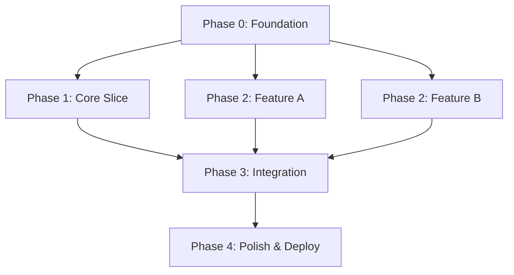

# Implementation Plan

**Project / System:** [Name]
**Document ID:** IMP-[IDENTIFIER]-[VERSION]
**Status:** `Draft` | `In Review` | `Approved` | `In Progress` | `Complete`
**Version:** 1.0.0
**Date:** YYYY-MM-DD
**Author(s):** [Name, Role]
**Related Documents:** [System Architecture Doc, Technical Specification, Project Plan]

---

## 1. Overview

### 1.1 Purpose

[2-3 sentences: what is being built, and what does this plan sequence that the project plan and architecture doc do not already cover?]

### 1.2 Starting State

[What already exists, if anything: prior codebase, decided tech stack, existing infrastructure. State "greenfield" explicitly if nothing exists yet.]

### 1.3 Execution Context

**Built by:** `Human team` / `AI coding agent` / `Both`
[If an agent will execute this directly, note that each phase below must be self-contained and independently verifiable.]

---

## 2. Foundation Layer

> Components that must exist before feature work begins. Build these first regardless of feature priority.

| Component | Why It's Foundational | Owner |
| :--- | :--- | :--- |
| [e.g., Data model / core schema] | [Nearly everything reads or writes through it] | |
| [e.g., Auth & session handling] | [Most features require an authenticated user context] | |
| [e.g., CI/CD + environment setup] | [Nothing can be verified or deployed without it] | |

---

## 3. Resource Allocation

| Skill / Role | Team Member(s) | Phases Involved | Availability (%) | Notes |
| :--- | :--- | :--- | :--- | :--- |
| [e.g., Backend (Node/Postgres)] | [e.g., Dev A, Dev B] | [e.g., 0, 1, 2] | [e.g., 100%] | |
| [e.g., Frontend (React)] | [e.g., Dev C] | [e.g., 1, 2, 3] | [e.g., 80%] | [e.g., 20% on other project] |
| [e.g., DevOps] | [e.g., Dev D] | [e.g., 0, 4] | [e.g., 50%] | [e.g., Shared with other teams] |
| [e.g., QA] | [e.g., QA Engineer] | [e.g., 1, 2, 3, 4] | [e.g., 100%] | |

**Bottleneck risk:** [e.g., Dev D is the only DevOps resource — Phase 0 and Phase 4 cannot overlap]
**Contingency buffer:** [e.g., 20% added to all estimates for unknowns]

---

## 4. Phased Build Sequence

> Each phase below follows a consistent template: what gets built, estimated duration, dependencies, readiness criteria, done criteria, verification steps, and rollback procedure.

### Phase 0: Foundation

**Builds:** [Foundation-layer components from Section 2]
**Estimated Duration:** [e.g., 1-2 weeks]
**Depends on:** [Nothing — starting state]
**Definition of Ready:** [e.g., Architecture and data model are approved]
**Definition of Done:** [e.g., Schema migrated, auth flow passes smoke test, CI pipeline runs green on a trivial commit]
**Verification:** [Specific check(s) that prove Done - not just "looks complete"]
**Code Review:** [e.g., Two reviewers required — security-sensitive auth code]
**Rollback:** [e.g., Revert migration, remove CI config. No user-facing impact since no users yet.]

### Phase 1: [Name - e.g., Core vertical slice]

**Builds:** [List features/components - prefer one complete vertical slice over a partial layer]
**Estimated Duration:** [e.g., 2-3 weeks]
**Depends on:** Phase 0
**Definition of Ready:** [What must be true to start]
**Definition of Done:** [Specific, verifiable condition]
**Verification:** [Test/check that proves it]
**Code Review:** [e.g., One reviewer, automated checks must pass]
**Rollback:** [e.g., Feature-flagged off; database changes backward-compatible; can revert deploy without data loss]

### Phase 2: [Name]

**Builds:** [...]
**Estimated Duration:** [e.g., X weeks]
**Depends on:** [Phase(s)]
**Definition of Ready:** [...]
**Definition of Done:** [...]
**Verification:** [...]
**Code Review:** [...]
**Rollback:** [...]

*(Repeat per phase using this exact template. Independent workstreams with no dependency on each other belong in the same phase.)*

---

## 5. Dependency Map

| Component | Depends On | Can Run in Parallel With |
| :--- | :--- | :--- |
| [Component A] | [Foundation] | [Component B] |
| [Component B] | [Foundation] | [Component A] |
| [Component C] | [Component A, B] | [None - integration point] |

### Dependency Graph

*(Customize to match the actual phases. Show all dependency edges.)*

---

## 6. Integration Checkpoints

| Checkpoint | Workstreams Being Integrated | Verification |
| :--- | :--- | :--- |
| [e.g., End of Phase 1] | [Frontend flow + backend API] | [Full end-to-end test of the vertical slice] |

---

## 7. High-Uncertainty Items and Fallbacks

| Item | Uncertainty | Primary Approach | Fallback If It Doesn't Work |
| :--- | :--- | :--- | :--- |
| [e.g., Third-party API rate limits] | [Unknown actual throughput] | [Direct integration] | [Add a queue/buffer layer] |

---

## 8. Technical Debt Register

> Track shortcuts taken during implementation. Each entry must have an owner and a resolution target.

| # | What | Why It Was Incurred | Owner | Target Resolution | Cost of Leaving Unresolved |
| :--- | :--- | :--- | :--- | :--- | :--- |
| 1 | [e.g., Hardcoded config values] | [e.g., Deadline pressure] | [Name] | [e.g., Phase 3] | [e.g., Blocks multi-environment deploy] |

---

## 9. Completion Criteria (Whole Project)

[The observable, testable condition(s) that mean the full implementation is done and ready for the deployment-plan skill to take over for release.]

---

## 10. Post-Implementation Handoff

| Handoff Item | Recipient | Artifact | Notes |
| :--- | :--- | :--- | :--- |
| **Codebase** | [e.g., Engineering team] | [e.g., Git repository, CI pipeline] | [e.g., All tests green, code reviewed] |
| **Documentation** | [e.g., New team members, AI agents] | [e.g., .engineering-docs/ folder] | [e.g., Reading order defined in index.md] |
| **Runbook** | [e.g., On-call team] | [e.g., technical-runbook] | [e.g., Monitoring, alerting, incident response] |
| **Known issues** | [e.g., Engineering team] | [e.g., Technical debt register, backlog] | [e.g., Items from Section 8] |
| **Access & credentials** | [e.g., DevOps / Security] | [e.g., Vault / secrets manager] | [e.g., All credentials rotated post-handoff] |
