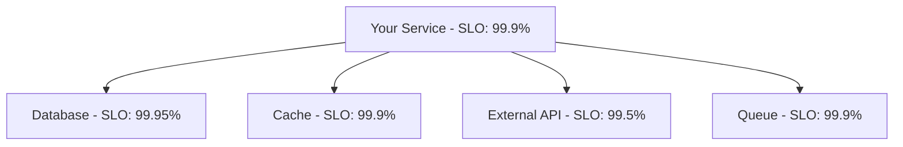

# SLO & Error Budget Document

**Service:** [Service / API Name]
**Document ID:** SLO-[SERVICE]-[VERSION]
**Status:** `Draft` | `In Review` | `Approved` | `Under Renegotiation`
**Version:** 1.0.0
**Date:** YYYY-MM-DD
**Author(s):** [Name, Role]
**Reviewers:** [Name, Role - Engineering] | [Name, Role - Business/Product owner]
**Review Cadence:** [e.g., Quarterly, or after any SLO breach]

---

## 1. Overview

### 1.1 Purpose

[2-3 sentences: what service does this cover, why does it need formal reliability targets now, and who consumes this document (on-call engineers, leadership, customers)?]

### 1.2 Critical User Journeys

> The SLIs below must trace back to something a real user actually experiences. List the journeys that matter before picking metrics.

| Journey | Why It Matters | Current Pain Point (if any) |
| :--- | :--- | :--- |
| [e.g., Merchant checkout completion] | [Revenue-critical path] | [e.g., No formal target today; anecdotal slowness complaints] |

---

## 2. Service Level Indicators (SLIs)

| ID | SLI | Measurement | Good Event Definition |
| :--- | :--- | :--- | :--- |
| SLI-01 | [e.g., Checkout availability] | [proportion of checkout requests returning non-5xx] | [HTTP status < 500 within 5s] |
| SLI-02 | [e.g., Checkout latency] | [proportion of requests under threshold] | [Response time < 300ms] |
| SLI-03 | [e.g., Payment durability] | [proportion of accepted payments not silently lost] | [Ledger entry exists within 60s of acceptance] |

### 2.1 SLI Implementation (Monitoring Queries)

> Exact queries that implement each SLI in your monitoring system. These must be executable as-is.

| SLI | Monitoring System | Query / Metric |
| :--- | :--- | :--- |
| SLI-01 (Availability) | `Prometheus` | `sum(rate(http_requests_total{service="[service]",code!~"5.."}[30d])) / sum(rate(http_requests_total{service="[service]"}[30d]))` |
| SLI-01 (Availability) | `Datadog` | `sum:http.requests{service:[service],!code:5xx}.as_count() / sum:http.requests{service:[service]}.as_count()` |
| SLI-02 (Latency) | `Prometheus` | `sum(rate(http_request_duration_seconds_bucket{service="[service]",le="0.3"}[30d])) / sum(rate(http_request_duration_seconds_count{service="[service]"}[30d]))` |
| SLI-02 (Latency) | `Datadog` | `sum:http.request_duration.sum{service:[service]} / sum:http.request_duration.count` (with threshold filter) |
| SLI-03 (Durability) | `[System]` | `[Exact query for durability measurement]` |

**Implementation gaps:** [Document any gap between the ideal SLI definition and what the metric proxy actually measures - e.g., "Availability is measured at the load balancer, not end-to-end to the database. A database-side failure that does not produce a 5xx at the LB is not captured."]

**Data retention:** [Metric data is retained for N days. The SLO measurement window is N days. Retention >= window: Yes / No.]

---

## 3. Service Level Objectives (SLOs)

| SLI | Target | Measurement Window | Rationale |
| :--- | :--- | :--- | :--- |
| SLI-01 (Availability) | [e.g., 99.9%] | Rolling 30 days | [Evidence: cost of downtime, baseline history] |
| SLI-02 (Latency) | [e.g., 95% < 300ms] | Rolling 30 days | [Evidence] |
| SLI-03 (Durability) | [e.g., 99.99%] | Rolling 30 days | [Payment loss has direct financial + trust cost] |

---

## 4. Error Budget

### 4.1 Budget Calculation

| SLI | SLO | Error Budget (per 30 days) | Budget in Concrete Terms |
| :--- | :--- | :--- | :--- |
| SLI-01 | 99.9% | 0.1% | [~43 minutes of full downtime-equivalent per 30 days] |

### 4.2 Multi-Window, Multi-Burn-Rate Alerts

| Alert | Burn Rate | Long Window | Short Window | Action |
| :--- | :--- | :--- | :--- | :--- |
| Fast burn | 14.4x | 1h | 5m | Page on-call immediately |
| Moderate burn | 6x | 6h | 30m | Page on-call |
| Slow burn | 1x | 3d | 6h | File ticket, review within the week |

---

## 5. Error Budget Policy

> Agreed in advance, applies automatically - not renegotiated mid-incident.

| Budget Remaining | Policy |
| :--- | :--- |
| > 50% | Ship normally. |
| 20-50% | Increase deploy review rigor; avoid risky/large changes without extra sign-off. |
| < 20% | Feature work slows; reliability fixes get priority. |
| 0% (exhausted) | Feature freeze until budget recovers, or explicit leadership sign-off to continue shipping at accepted risk. |

**Policy owner (final call on exceptions):** [Name, Role]

---

## 5.1 Error Budget Dashboard

> A single dashboard that answers "how much budget do we have left?" in under 5 seconds.

**Dashboard URL:** [Link to Grafana / Datadog / SLO platform]

**Dashboard components:**

| Panel | Type | Purpose | Query / Source |
| :--- | :--- | :--- | :--- |
| SLI time series | Time series graph | Show SLI value over measurement window with SLO target line | [SLI implementation query from Section 2.1] |
| Budget remaining | Gauge / Stat | Show error budget as percentage remaining | `(1 - (errors / budget)) * 100` |
| Budget burn rate | Stat + threshold | Show current burn rate vs. alert thresholds | `[burn rate query]` |
| Budget history | Time series | Show budget consumption trend over last N months | `[historical query]` |
| Active alerts | Alert list | Show any active SLO burn-rate alerts | [Alertmanager / Datadog monitor status] |

**Recommended tool:** [Grafana / Datadog SLO widgets / Nobl9 / Lightstep]

---

## 5.2 Alerting Rule Implementation

> Exact alerting rules implemented in the monitoring system. These must be deployable as-is.

### Prometheus Alerting Rules

```yaml
groups:
  - name: [service]-slo-alerts
    rules:
      # Fast burn: 14.4x burn rate, 1h window, 5m validation
      - alert: [SERVICE]_SLO_FastBurn_[SLI]
        expr: (
          1 - (sum(rate(http_requests_total{service="[service]",code!~"5.."}[1h])) / sum(rate(http_requests_total{service="[service]"}[1h])))
        ) > (1 - [SLO_TARGET]) * 14.4
        for: 5m
        labels:
          severity: critical
        annotations:
          summary: "Fast burn on [service] [SLI] SLO"
          runbook_url: "[link to runbook]"

      # Moderate burn: 6x burn rate, 6h window, 30m validation
      - alert: [SERVICE]_SLO_ModerateBurn_[SLI]
        expr: (
          1 - (sum(rate(http_requests_total{service="[service]",code!~"5.."}[6h])) / sum(rate(http_requests_total{service="[service]"}[6h])))
        ) > (1 - [SLO_TARGET]) * 6
        for: 30m
        labels:
          severity: warning
        annotations:
          summary: "Moderate burn on [service] [SLI] SLO"

      # Slow burn: 1x burn rate, 3d window, 6h validation
      - alert: [SERVICE]_SLO_SlowBurn_[SLI]
        expr: (
          1 - (sum(rate(http_requests_total{service="[service]",code!~"5.."}[3d])) / sum(rate(http_requests_total{service="[service]"}[3d])))
        ) > (1 - [SLO_TARGET]) * 1
        for: 6h
        labels:
          severity: info
        annotations:
          summary: "Slow burn on [service] [SLI] SLO - investigate this week"
```

### Datadog Monitor Configuration

| Monitor | Query | Evaluation Window | Alert Threshold | Warning Threshold |
| :--- | :--- | :--- | :--- | :--- |
| Fast burn | `[SLI query]` | `1h` (5m validation) | `> [SLO] * 14.4x error rate` | - |
| Moderate burn | `[SLI query]` | `6h` (30m validation) | `> [SLO] * 6x error rate` | - |
| Slow burn | `[SLI query] | `3d` (6h validation) | - | `> [SLO] * 1x error rate` |

**Alert routing:** Fast burn -> Page on-call immediately. Moderate burn -> Page on-call. Slow burn -> Create ticket, review within the week.

---

## 6. SLO Breach Response Procedure

> What to do when an SLO is breached. Different from an SLA breach.

### 6.1 SLO Breach (Internal Target Missed)

| Step | Action | Owner | Timeline |
| :--- | :--- | :--- | :--- |
| 1 | Acknowledge the burn-rate alert | On-call engineer | Within 5 min |
| 2 | Investigate root cause using runbook | On-call engineer | Within 15 min |
| 3 | Mitigate if possible (per runbook) | On-call engineer | Within 30 min |
| 4 | File incident report / postmortem | Incident owner | Within 48 hours |
| 5 | Review error budget consumption at next SLO review meeting | Engineering lead | Quarterly |

### 6.2 SLA Breach (External Contract Missed)

| Step | Action | Owner | Timeline |
| :--- | :--- | :--- | :--- |
| 1 | All steps from SLO breach (above) | | |
| 2 | Notify customer-facing teams and leadership | Engineering lead | Immediately |
| 3 | Calculate service credits owed per contract terms | Finance / Legal | Within 5 business days |
| 4 | Issue service credits or contractual remedies | Customer success | Per contract terms |
| 5 | Conduct postmortem with SLA breach as explicit focus | Engineering lead | Within 48 hours |
| 6 | Review and potentially adjust SLO/SLA buffer | Engineering + Business | Within 2 weeks |

**Escalation:** If an SLO breach is trending toward an SLA breach (error budget exhaustion imminent), escalate to [Name, Role] BEFORE the SLA breach occurs.

---

## 7. External SLA (if applicable)

| Metric | Internal SLO | External SLA (customer-facing) | Buffer | Penalty for Breach |
| :--- | :--- | :--- | :--- | :--- |
| Availability | [e.g., 99.9%] | [e.g., 99.5%] | [0.4%] | [e.g., service credit per contract §X] |

> The external SLA should always be looser than the internal SLO. The gap is what protects the business from a contractual breach every time an internal target is missed.

### 7.1 SLA Buffer Sizing

| Factor | Assessment | Impact on Buffer |
| :--- | :--- | :--- |
| Measurement error (SLI proxy accuracy) | [e.g., Measured at LB, not end-to-end] | [Increase buffer by X%] |
| Incident frequency (last 12 months) | [e.g., 3 SLO breaches] | [Increase buffer by X%] |
| Mean time to recovery | [e.g., 45 minutes average] | [Increase buffer by X%] |
| Business risk tolerance | [e.g., High - enterprise customers] | [Increase buffer by X%] |

**Recommended buffer:** SLA = `[SLO - X%]` (e.g., SLO 99.9% -> SLA 99.5%)

**Buffer review cadence:** [Quarterly, or after any SLA breach]

---

## 8. Dependency-Aware SLOs

> Services do not operate in isolation. Document dependencies and their impact on your SLO.

### 8.1 Service Dependency Map



### 8.2 Dependency SLO Requirements

| Dependency | Dependency's SLO | Your SLO | Composite SLO Ceiling | Graceful Degradation? |
| :--- | :--- | :--- | :--- | :--- |
| [Database] | [99.95%] | [99.9%] | [99.95%] | `No` - hard dependency |
| [Cache] | [99.9%] | [99.9%] | [99.9%] | `Yes` - serve from DB (slower) |
| [External API] | [99.5%] | [99.9%] | [99.5%] | `Yes` - queue and retry |
| [Queue] | [99.9%] | [99.9%] | [99.9%] | `Yes` - process inline (slower) |

**Composite SLO calculation:** The effective SLO ceiling is the product of all hard dependency SLOs. For this service: `99.95% * 99.9% = 99.85%` (with graceful degradation on cache and queue). With graceful degradation on the external API dependency, the composite SLO is not dragged down by its lower SLO.

**Shared fate:** [Database] is a shared dependency for [Service A, Service B, Service C]. A database failure affects all three SLOs simultaneously. This is a known concentrated risk.

---

## 9. Review and Re-Baselining

- **Next scheduled review:** YYYY-MM-DD
- **Trigger for off-cycle review:** [e.g., any SLA breach, major architecture change, 2 consecutive budget exhaustions]
- **Owner of this document:** [Name, Role]
