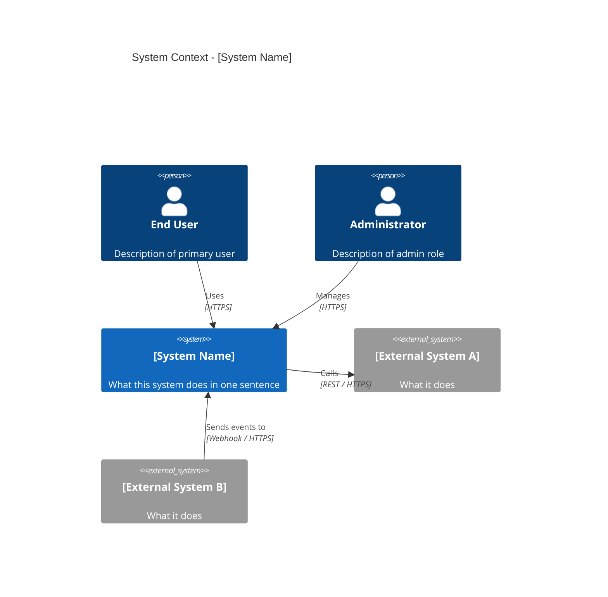
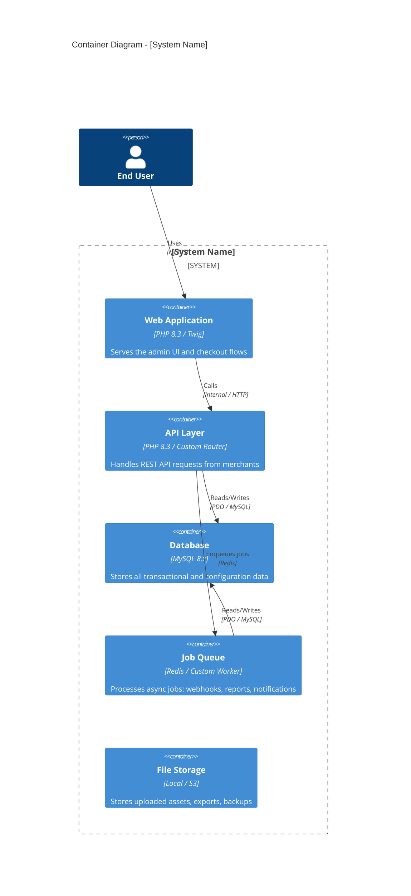
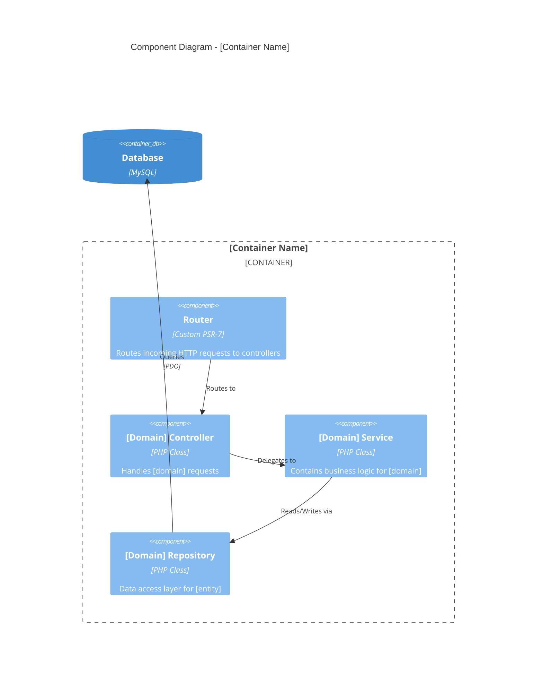
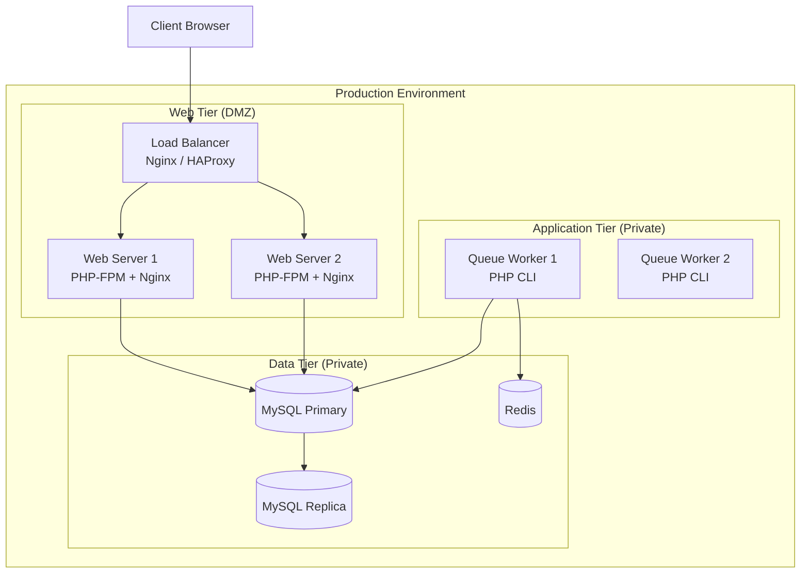
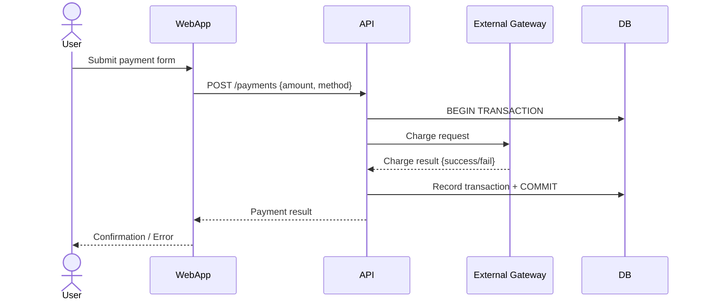
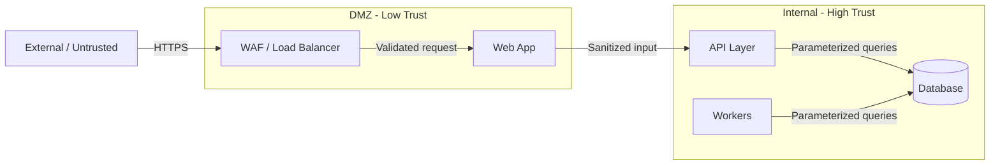

# System Architecture Document

**System:** [System Name]
**Document ID:** SAD-[SYSTEM]-[VERSION]
**Status:** `Draft` | `In Review` | `Approved` | `Superseded`
**Version:** 1.0.0
**Date:** YYYY-MM-DD
**Author(s):** [Name, Role]
**Reviewers:** [Name, Role] | [Name, Role]

---

## 1. Executive Summary

> 2-3 paragraphs. Describe the system's purpose, its architectural style (monolith, microservices, event-driven, layered, etc.), the key drivers that shaped the architecture (NFRs, constraints, team structure), and the most important architectural decisions made.

---

## 2. Architecture Principles

> The guiding principles that govern all architectural decisions in this system. These act as tie-breakers when trade-offs arise.

| Principle | Rationale | Implication |
| :--- | :--- | :--- |
| [e.g., Simplicity over sophistication] | [Reason] | [What this means in practice] |
| [e.g., Explicit over implicit] | [Reason] | [What this means in practice] |
| [e.g., Data integrity over performance] | [Reason] | [What this means in practice] |

---

## 3. System Context (C4 Level 1)

> Who uses the system and what external systems does it depend on or serve? Intended for all stakeholders, including non-technical.



### External System Dependencies

| External System | Direction | Protocol | Purpose | SLA Dependency |
| :--- | :--- | :--- | :--- | :--- |
| [System A] | Outbound | REST/HTTPS | [Why we call it] | Yes / No |
| [System B] | Inbound | Webhook | [Why it calls us] | No |

---

## 4. Container Architecture (C4 Level 2)

> The major deployable/executable units. Each container has its own process space, deployment lifecycle, and technology.



### Container Inventory

| Container | Technology | Responsibility | Scalability Strategy |
| :--- | :--- | :--- | :--- |
| [Web App] | [PHP 8.3 / Twig] | [Description] | [Horizontal / Vertical] |
| [API] | [PHP 8.3] | [Description] | [Horizontal] |
| [Database] | [MySQL 8.x] | [Description] | [Read replicas / Sharding] |
| [Queue] | [Redis] | [Description] | [Horizontal workers] |

---

## 5. Component Architecture (C4 Level 3)

> Internal structure of the most critical containers. Not required for every container - focus on the most complex ones.

### 5.1 [Container Name] - Internal Components



---

## 6. Deployment View

> Where do the containers run? What is the network topology? What cloud regions or data centers are involved?



### Infrastructure Inventory

| Component | Type | Specs | Count | Region | Managed By |
| :--- | :--- | :--- | :--- | :--- | :--- |
| Web Server | VPS / Container | [CPU/RAM] | [N] | [Region] | [Team] |
| Database Primary | VPS / RDS | [CPU/RAM/Storage] | 1 | [Region] | [Team] |

---

## 7. Process View - Key Flows

> How does the system behave at runtime for its most critical use cases?

### 7.1 [Critical Flow Name - e.g., Payment Processing]



### 7.2 [Next Critical Flow]

[Follow same structure]

---

## 8. Integration Map

> Every integration point the system has with external systems.

| Integration | Direction | Protocol | Auth | Data Format | Error Handling | SLA |
| :--- | :--- | :--- | :--- | :--- | :--- | :--- |
| [External System A] | Outbound | REST/HTTPS | API Key | JSON | Retry x3, exponential backoff | 99.9% |
| [External System B] | Inbound | Webhook | HMAC-SHA256 | JSON | Return 200 immediately, process async | N/A |

---

## 9. Data Flow and Trust Boundaries

> Where does data enter the system, how does it move between containers, and where are the trust boundaries?



### Sensitive Data Classification

| Data Category | Classification | Storage | Transmission | Retention |
| :--- | :--- | :--- | :--- | :--- |
| Payment card data | `Restricted` | Tokenized / Not stored | TLS 1.2+ | Never raw |
| User PII | `Confidential` | Encrypted at rest | TLS 1.2+ | Per GDPR policy |
| Session tokens | `Confidential` | Server-side (Redis) | HTTPS only | Session lifetime |
| API keys | `Confidential` | Hashed (SHA-256) | HTTPS only | Indefinite |

---

## 10. Security Architecture

### 10.1 Threat Model Summary

| STRIDE Category | Key Threats | Architectural Control |
| :--- | :--- | :--- |
| Spoofing | [e.g., credential stuffing, token replay] | [e.g., rate limiting, short token expiry, MFA] |
| Tampering | [e.g., SQL injection, MITM] | [e.g., parameterized queries, TLS 1.2+] |
| Repudiation | [e.g., disputed transactions] | [e.g., immutable audit log] |
| Information Disclosure | [e.g., IDOR, stack traces] | [e.g., tenant-scoped queries, generic error responses] |
| Denial of Service | [e.g., application-layer flooding] | [e.g., rate limiting, request size limits] |
| Elevation of Privilege | [e.g., mass assignment, RBAC bypass] | [e.g., allowlist input, middleware permission checks] |

### 10.2 Security Controls by Trust Zone

| Zone | Controls |
| :--- | :--- |
| External (untrusted) | WAF rules, TLS termination, input validation, rate limiting |
| DMZ (semi-trusted) | Request filtering, authentication enforcement, CORS policy |
| Internal (trusted) | Service-to-service auth (mTLS / signed tokens), parameterized queries |
| Data (high trust) | Encryption at rest, access logging, backup encryption |

### 10.3 Secrets Management

| Secret Type | Storage | Rotation Policy | Access Method |
| :--- | :--- | :--- | :--- |
| Database credentials | [Vault / env / managed service] | [Every N days] | [How app reads it] |
| API keys | [Vault / env] | [On compromise or N days] | [How app reads it] |
| Encryption keys | [KMS / HSM] | [Annually] | [How app reads it] |

---

## 11. Disaster Recovery

### 11.1 RPO / RTO Targets

| Metric | Target | Measurement |
| :--- | :--- | :--- |
| RPO (Recovery Point Objective) | [N hours] of data loss acceptable | [How measured] |
| RTO (Recovery Time Objective) | [N hours] to restore service | [How measured] |

### 11.2 Backup Strategy

| Component | What Is Backed Up | Frequency | Retention | Location | Encrypted? |
| :--- | :--- | :--- | :--- | :--- | :--- |
| Database | Full + binlog/WAL | [Daily + continuous] | [N days] | [Location] | Yes |
| File storage | Uploaded assets | [Daily incremental] | [N days] | [Location] | Yes |
| Configuration | App config, secrets | [On change] | [N versions] | [Git / vault] | Yes |

### 11.3 Failover Strategy

**Approach:** `Active-Passive` | `Active-Active` | `Manual Failover`

**Failover Procedure:**
1. [Step 1 - e.g., DNS switch to secondary region]
2. [Step 2 - e.g., Promote database replica to primary]
3. [Step 3 - e.g., Verify application health checks pass]
4. [Step 4 - e.g., Notify stakeholders of degraded mode]

**DR Testing:** [Frequency - e.g., Quarterly tabletop exercises, annual full failover test]

---

## 12. Observability Architecture

### 12.1 Logging

| Aspect | Specification |
| :--- | :--- |
| Format | JSON structured logs |
| Correlation ID | `X-Request-ID` header propagated through all services |
| Log Levels | ERROR (alerts), WARN (monitoring), INFO (audit), DEBUG (dev only) |
| Aggregation | [e.g., ELK / CloudWatch / Datadog] |
| Retention | [N days hot, N months cold storage] |

### 12.2 Metrics

| Metric | Collection Method | Dashboard |
| :--- | :--- | :--- |
| Request rate (RPS) | [Prometheus / CloudWatch] | Operational dashboard |
| Error rate (5xx %) | [Collection method] | Operational dashboard |
| Latency percentiles (p50, p95, p99) | [Collection method] | Operational dashboard |
| Queue depth | [Collection method] | Operational dashboard |
| DB connection pool utilization | [Collection method] | Database dashboard |

### 12.3 Distributed Tracing

| Aspect | Specification |
| :--- | :--- |
| Propagation standard | W3C Trace Context / B3 |
| Sampling rate | [100% for errors, 10% for success] |
| Storage | [e.g., Jaeger / Datadog APM] |

### 12.4 Alerting

| Severity | Criteria | Response Time | Escalation |
| :--- | :--- | :--- | :--- |
| P1 - Critical | Service down or data loss | 15 min | On-call -> Engineering Lead -> CTO |
| P2 - High | Degraded performance or partial outage | 1 hour | On-call -> Engineering Lead |
| P3 - Warning | Threshold breach, non-impacting | 4 hours | On-call during business hours |
| P4 - Info | Anomaly detected | Next business day | Review in standup |

---

## 13. Data Architecture

### 13.1 Schema Overview

> Reference `database-design-document` for full schema. Summarize key entities and relationships here.

### 13.2 Partitioning Strategy

| Table | Partition Key | Strategy | Rationale |
| :--- | :--- | :--- | :--- |
| [e.g., audit_log] | `created_at` | Range (monthly) | Query patterns are time-scoped; easy archival |
| [e.g., events] | `tenant_id` | Hash | Even distribution for multi-tenant workloads |

### 13.3 Caching Strategy

| What Is Cached | Cache Layer | TTL | Invalidation Strategy |
| :--- | :--- | :--- | :--- |
| Session data | Redis | 15 minutes | Explicit logout or TTL expiry |
| Hot query results | Redis / Application | 5 minutes | Event-driven invalidation on write |
| Static assets | CDN | 1 hour | Cache-bust on deploy via content hash |

### 13.4 Data Lifecycle

| Data Category | Retention | Archival | Deletion |
| :--- | :--- | :--- | :--- |
| Transaction records | [N years] | [Archive to cold storage after N months] | [Hard delete after N years] |
| Audit logs | [N years] | [Compressed after N months] | [Regulated deletion] |
| User PII | [Until account deletion] | None | GDPR erasure within 30 days |

---

## 14. API Governance

### 14.1 Versioning Policy

**Strategy:** URI versioning (`/v1/`, `/v2/`)

| Rule | Policy |
| :--- | :--- |
| Additive changes | No version bump required |
| Breaking changes | New major version required |
| Minimum support window | [N months] after successor GA |
| Deprecation headers | `Deprecation` + `Sunset` + `Link` headers on old versions |

### 14.2 Rate Limiting

| Consumer Tier | Limit | Window | Burst Allowance |
| :--- | :--- | :--- | :--- |
| Standard | [N] requests | Per minute | [M] requests/second |
| Premium | [N] requests | Per minute | [M] requests/second |
| Internal service | [N] requests | Per minute | Unlimited |

### 14.3 API Gateway

| Aspect | Specification |
| :--- | :--- |
| Gateway used? | Yes / No |
| Responsibilities | [Auth, rate limiting, routing, transformation, logging] |
| Product | [e.g., Kong, AWS API Gateway, custom] |

---

## 15. Cost Model

### 15.1 Monthly Infrastructure Cost Estimate

| Component | Spec | Count | Monthly Cost |
| :--- | :--- | :--- | :--- |
| Web servers | [Type/size] | [N] | $[X] |
| Database | [Type/size] | [N] | $[X] |
| Cache (Redis) | [Type/size] | [N] | $[X] |
| Queue / Workers | [Type/size] | [N] | $[X] |
| Storage | [Type] | [N GB/TB] | $[X] |
| Third-party services | [List] | - | $[X] |
| **Total** | | | **$[X]** |

### 15.2 Scaling Cost Curve

| Scale | Est. Monthly Cost | Key Cost Driver |
| :--- | :--- | :--- |
| Current (1x) | $[X] | [Driver] |
| 10x traffic | $[X] | [Driver] |
| 100x traffic | $[X] | [Driver] |

---

## 16. Testing Architecture

### 16.1 Test Environments

| Environment | Purpose | Data | Refresh Frequency |
| :--- | :--- | :--- | :--- |
| Local / CI | Unit + integration tests | Synthetic | Per build |
| Staging | E2E, performance, security | Anonymized production snapshot | Weekly |
| Production | Smoke tests, canary validation | Real | N/A |

### 16.2 CI/CD Pipeline

```
[Push] -> [Lint + Static Analysis] -> [Unit Tests] -> [Build] -> [Integration Tests] -> [Security Scan] -> [Deploy to Staging] -> [E2E Tests] -> [Manual Approval] -> [Deploy to Production]
```

### 16.3 Contract Testing

| Consumer | Provider | Method | Tool |
| :--- | :--- | :--- | :--- |
| [Service A] | [Service B] | [API contract verification] | [Pact / OpenAPI validator] |

---

## 17. Development View

### 17.1 Code Organization

**Repository structure:** `Monorepo` | `Polyrepo`

```
project-root/
  src/
    [module-a]/
    [module-b]/
  tests/
  infrastructure/
  docs/
```

### 17.2 Module Boundaries

| Module | Public API | Internal Dependencies | External Dependencies |
| :--- | :--- | :--- | :--- |
| [Module A] | [Classes/functions exposed] | [Other modules it uses] | [Third-party libs] |

### 17.3 Dependency Rules

- [e.g., Module A must not depend on Module B directly; communicate via events]
- [e.g., No circular dependencies between packages]

---

## 18. Architecture Decision Records

> Each ADR is an immutable record. Use the inline template below for each decision.

### ADR-NNN: [Decision Title]

**Status:** `Proposed` | `Accepted` | `Deprecated` | `Superseded by ADR-XXX`
**Date:** YYYY-MM-DD
**Deciders:** [Name, Role]

**Context:** [What is the issue that requires a decision?]

**Decision:** [What was decided?]

**Alternatives Considered:**
| Alternative | Pros | Cons | Why Rejected |
| :--- | :--- | :--- | :--- |
| [Option A] | [Pros] | [Cons] | [Reason] |

**Consequences:**
- [Positive consequence]
- [Negative consequence / trade-off]

---

## 19. Quality Attribute Requirements

> The architectural decisions here are driven by specific measurable NFRs.

| Quality Attribute | Target | Architectural Decision | ADR Reference |
| :--- | :--- | :--- | :--- |
| Availability | 99.9% uptime | Multi-instance deployment behind load balancer | ADR-003 |
| Performance | p99 < 200ms API response | MySQL connection pooling + Redis caching | ADR-005 |
| Security | Zero SQL injection risk | Parameterized PDO queries enforced at repo layer | ADR-002 |
| Scalability | 10x traffic handled without code change | Stateless web tier; horizontal scaling | ADR-004 |
| Maintainability | New developer productive in < 1 week | PSR-4 autoloading, clear layer separation | ADR-001 |

---

## 20. Alternatives Considered

| Alternative | Pros | Cons | Why Not Chosen |
|:---|:---|:---|:---|
| [Alternative 1 - e.g., Microservices architecture] | [Independent scaling, technology diversity] | [Operational complexity, distributed transactions] | [Team size too small to operate; monolith simpler for current scale] |
| [Alternative 2 - e.g., Serverless / FaaS] | [Zero server management, auto-scaling] | [Cold start latency, vendor lock-in, limited runtime control] | [p99 latency requirement incompatible with cold starts; need persistent connections] |

---

## 21. Architecture Decision Record Log

> Summary of all significant architectural decisions. Each ADR is an immutable record. Use `adr-template.md` for the full detail.

| ADR ID | Title | Status | Date | Summary |
| :--- | :--- | :--- | :--- | :--- |
| ADR-001 | [Decision title] | `Accepted` | YYYY-MM-DD | [One-sentence summary of the decision] |
| ADR-002 | [Decision title] | `Accepted` | YYYY-MM-DD | [One-sentence summary] |
| ADR-003 | [Decision title] | `Superseded by ADR-007` | YYYY-MM-DD | [One-sentence summary] |

---

## 22. Known Technical Debt

> Architectural compromises made deliberately. Documenting these prevents them from becoming invisible and permanent.

| Item | Description | Why Accepted | Remediation Path | Priority |
| :--- | :--- | :--- | :--- | :--- |
| [Debt item] | [Technical detail] | [Constraint that forced the compromise] | [How to fix eventually] | `High` / `Medium` / `Low` |

---

## 23. Glossary

| Term | Definition |
| :--- | :--- |
| [Domain / Technical term] | [Plain-language definition] |
