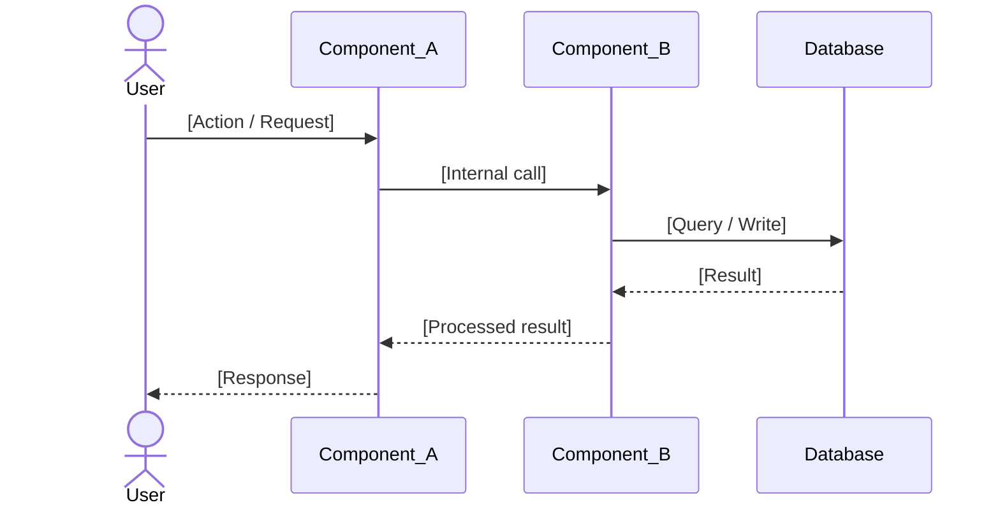

# Technical Design Document

**Feature / Component:** [Name]
**Document ID:** TDD-[IDENTIFIER]-[VERSION]
**Status:** `Draft` | `In Review` | `Approved` | `Implemented` | `Superseded`
**Version:** 1.0.0
**Date:** YYYY-MM-DD
**Author(s):** [Name, Role]
**Reviewers:** [Name, Role] | [Name, Role]
**Related TSD:** [TSD-XXX - link to Technical Specification if exists]
**Related ADR(s):** [ADR-XXX, ADR-YYY]

---

## 1. Problem Statement

> What problem does this design solve? Why does it need to be solved now? What is the cost of not solving it?
> Include evidence where possible: error rates, support tickets, performance benchmarks, business impact.

[Problem description with evidence]

---

## 2. Goals and Non-Goals

### Goals
- [Specific, measurable outcome 1]
- [Specific, measurable outcome 2]
- [Specific, measurable outcome 3]

### Non-Goals
> What this design explicitly does NOT solve. This prevents scope creep and misaligned expectations.

- [Out of scope item 1 - with brief reason]
- [Out of scope item 2]

---

## 3. Background and Context

> What does a reviewer need to know about the current state of the system to evaluate this design? Keep it factual and brief. Link to existing documentation rather than duplicating it.

[Relevant background - current behavior, existing architecture, key constraints]

---

## 4. Proposed Design

### 4.1 High-Level Approach

> One paragraph. Describe the solution approach at the level of a C4 Level 3 component description.

[High-level description of the solution]

### 4.2 Detailed Design

#### 4.2.1 System / Component Interaction



#### 4.2.2 Key Algorithms and Logic

> Describe any non-trivial logic, state machines, algorithms, or processing flows. Pseudocode is acceptable and often clearer than prose.

```
// Pseudocode or clear prose description of the core logic
function processX(input):
  validate(input)
  result = transform(input)
  persist(result)
  emit_event(result)
  return result
```

#### 4.2.3 Data Model Changes

> Document any new tables, columns, or indexes. Any changes to existing schema. Explain the migration strategy.

**New / Modified Tables:**

```sql
-- [table_name]: [Purpose]
CREATE TABLE [table_name] (
  id            BIGINT UNSIGNED NOT NULL AUTO_INCREMENT,
  [column_name] [TYPE] NOT NULL COMMENT '[Description]',
  created_at    DATETIME(6) NOT NULL DEFAULT CURRENT_TIMESTAMP(6),
  PRIMARY KEY   (id),
  INDEX idx_[column] ([column_name])
) ENGINE=InnoDB DEFAULT CHARSET=utf8mb4;
```

**Migration Strategy:** [e.g., Additive migration only - no destructive changes. Backward-compatible with current production.]

**Data Volume Estimate:** [e.g., Expected 10K rows/day, ~3.6M rows/year, negligible storage impact at 200 bytes/row average]

#### 4.2.4 API Contract Changes

> Document any new endpoints, modified endpoints, or removed endpoints. For each, specify method, path, request shape, response shape, error codes.

**New Endpoint: `POST /v1/[resource]`**

Request:
```json
{
  "field_a": "string (required) - [Description]",
  "field_b": 123,
  "field_c": true
}
```

Response `200 OK`:
```json
{
  "id": "string - [Description]",
  "status": "active",
  "created_at": "2026-01-01T00:00:00Z"
}
```

Error Responses:
| HTTP Status | Code | Condition |
| :--- | :--- | :--- |
| 400 | `validation_error` | Missing required field or invalid format |
| 401 | `unauthorized` | Missing or invalid authentication |
| 422 | `unprocessable` | Semantically invalid request (e.g., duplicate) |
| 500 | `internal_error` | Unexpected server error |

**Backward Compatibility:** [Is this a breaking change? How are existing clients affected?]

#### 4.2.5 Configuration and Environment

| Config Key | Type | Default | Description |
| :--- | :--- | :--- | :--- |
| `[KEY_NAME]` | string | `[default]` | [What it controls] |

---

## 5. Alternatives Considered

> **This section is mandatory.** Documenting rejected alternatives demonstrates due diligence and prevents future engineers from re-investigating paths already evaluated.

| Alternative | Pros | Cons | Why Not Chosen |
|:---|:---|:---|:---|
| [Alternative 1] | [Pros] | [Cons] | [Reason] |
| [Alternative 2] | [Pros] | [Cons] | [Reason] |

### Alternative 1: [Name]

**Description:** [Clear description of this approach]

**Why Rejected:**
- [Specific, evidence-based reason - e.g., "Adds 3rd-party dependency with active CVEs; not acceptable for PCI scope"]
- [Specific reason 2]

**Trade-off acknowledged:** [What we lose by not choosing this]

---

### Alternative 2: [Name]

**Description:** [Clear description]

**Why Rejected:**
- [Specific reason 1]
- [Specific reason 2]

**Trade-off acknowledged:** [What we lose]

---

### Why the Proposed Design Was Chosen

[A direct comparison: why the chosen approach beats the alternatives on the dimensions that matter most for this problem]

---

## 6. Security Considerations

> Apply STRIDE thinking: Spoofing, Tampering, Repudiation, Information Disclosure, Denial of Service, Elevation of Privilege.

| Threat | STRIDE Category | Attack Vector | Mitigation | Residual Risk |
| :--- | :--- | :--- | :--- | :--- |
| [Threat description] | S / T / R / I / D / E | [How an attacker would exploit it] | [Countermeasure implemented] | `Low` / `Med` / `High` |
| Replay attack on [endpoint] | Tampering | Replay captured request | HMAC timestamp validation; reject requests older than 5 min | Low |
| Brute-force [operation] | DoS | Automated credential stuffing | Rate limit: 5 attempts/IP/minute; exponential backoff | Low |
| Exposure of [sensitive data] in logs | Information Disclosure | Log scraping / access | Mask all PII and secrets before logging; enforced via logging middleware | Low |

### New Attack Surface Introduced

[Describe any new entry points, permissions, or trust boundaries this design introduces]

### Security Requirements Satisfied

- [ ] All inputs validated and sanitized at the boundary
- [ ] No sensitive data in logs or error messages
- [ ] Authentication and authorization enforced at every new endpoint
- [ ] No new direct database access outside the repository layer
- [ ] Secrets loaded from environment; never hardcoded

---

## 7. Performance and Scalability

### Expected Load Profile

| Metric | Current | Expected After Change | At 10x Scale |
| :--- | :--- | :--- | :--- |
| Requests per second | [N] | [N] | [N] |
| Database queries per request | [N] | [N] | [N] |
| Average response time | [Xms] | [Xms] | [Xms] |

### Performance Risks

| Risk | Impact | Mitigation |
| :--- | :--- | :--- |
| [Potential bottleneck] | [Description] | [How addressed - caching, indexing, pagination] |

---

## 8. Observability

### 8.1 Logging

| Log Event | Level | Fields | When Emitted |
| :--- | :--- | :--- | :--- |
| `[feature].request_started` | INFO | `request_id`, `user_id`, `operation` | On request received |
| `[feature].request_completed` | INFO | `request_id`, `duration_ms`, `status` | On successful completion |
| `[feature].request_failed` | ERROR | `request_id`, `error_code`, `error_message` | On failure |

### 8.2 Metrics

| Metric Name | Type | Labels | Description |
| :--- | :--- | :--- | :--- |
| `[feature]_requests_total` | Counter | `status`, `operation` | Total requests to this feature |
| `[feature]_request_duration_seconds` | Histogram | `operation` | Request latency distribution |
| `[feature]_errors_total` | Counter | `error_code` | Total errors by error code |

### 8.3 Alerting

| Alert | Condition | Severity | Runbook |
| :--- | :--- | :--- | :--- |
| [Feature] high error rate | > [X]% 5xx errors for 5 min | P2 | [Link to runbook] |
| [Feature] high latency | p99 > [X]ms for 5 min | P2 | [Link to runbook] |

---

## 9. Feature Flag Strategy

| Aspect | Specification |
| :--- | :--- |
| Flag name | `[feature_flag_name]` |
| Type | `Boolean toggle` / `Percentage rollout` / `User allowlist` |
| Default state | `Off` / `On` |
| Rollout phases | 1. Internal (dev) -> 2. Staging -> 3. Canary (5%) -> 4. Full rollout |
| Cleanup plan | Remove flag after [N] weeks of stable full rollout |

---

## 10. Data Migration

### 10.1 Migration Type

`Additive only` / `Destructive (requires downtime)` / `Online (pt-online-schema-change)`

### 10.2 Migration Steps

| Step | Command / Action | Reversible? | Estimated Duration |
| :--- | :--- | :--- | :--- |
| 1. [e.g., Add column] | `ALTER TABLE ... ADD COLUMN ...` | Yes | [N seconds] |
| 2. [e.g., Backfill data] | `UPDATE ... SET ... WHERE ...` | Yes (restore from backup) | [N minutes] |
| 3. [e.g., Add index] | `CREATE INDEX ...` | Yes (`DROP INDEX`) | [N minutes] |

### 10.3 Backward Compatibility

- [ ] Old code runs against new schema without errors
- [ ] New code runs against old schema without errors (during rollback window)
- [ ] Data backfill does not interfere with live traffic

### 10.4 Rollback Script

```sql
-- Rollback: reverse migration steps in order
-- Step 1: [reverse action]
-- Step 2: [reverse action]
```

---

## 11. Documentation Updates

| Document | Update Required | Owner | Status |
| :--- | :--- | :--- | :--- |
| OpenAPI spec | [New endpoints, modified schemas] | [Name] | `Planned` |
| Runbook | [New monitoring, troubleshooting procedures] | [Name] | `Planned` |
| User guide | [New feature documentation] | [Name] | `Planned` |
| ADR | [If significant architectural decision made] | [Name] | `Planned` / `N/A` |

---

## 12. Dependencies and Blockers

### 12.1 Upstream Dependencies (What must be done first?)

| Dependency | Type | Owner | Status | Blocking? |
| :--- | :--- | :--- | :--- | :--- |
| [e.g., Database migration for new table] | Internal | [Name] | `Complete` / `In Progress` | Yes |
| [e.g., Third-party API access approval] | External | [Vendor] | `Pending` | Yes |

### 12.2 Downstream Dependents (What depends on this?)

| Dependent | Team | Impact if Delayed |
| :--- | :--- | :--- |
| [e.g., Mobile app feature X] | [Team] | [Impact] |

### 12.3 Decision Dependencies

| Decision | Options | Decision Owner | Needed By |
| :--- | :--- | :--- | :--- |
| [e.g., Redis vs Memcached for session store] | [Option A vs Option B] | [Name] | YYYY-MM-DD |

---

## 13. Test Plan

| Test Type | What Is Verified | Tools / Method | Pass Criterion |
| :--- | :--- | :--- | :--- |
| Unit tests | [Business logic / algorithm correctness] | PHPUnit / Jest | 100% coverage of core logic |
| Integration tests | [Database interaction / API contract] | PHPUnit + Test DB | All CRUD operations verified |
| End-to-end tests | [Critical user flow] | Manual / Playwright | Happy path + 3 edge cases pass |
| Load test | [Performance NFR] | k6 / Locust | p99 < Xms at N concurrent users |
| Security test | [Input validation, auth boundaries] | Manual + OWASP ZAP | Zero high-severity findings |

### Edge Cases

| Scenario | Expected Behavior | Test Status |
| :--- | :--- | :--- |
| [Edge case 1] | [Expected outcome] | `Planned` |
| [Edge case 2 - e.g., concurrent writes] | [Expected outcome] | `Planned` |
| [Edge case 3 - e.g., external API timeout] | [Expected outcome] | `Planned` |

---

## 14. Rollout Plan

### Deployment Strategy

`Feature Flag` | `Blue-Green` | `Canary` | `Direct Deploy`

[Describe the deployment approach and why it was chosen for this change]

### Rollout Phases

| Phase | Scope | Success Criteria | Proceed Trigger |
| :--- | :--- | :--- | :--- |
| Phase 1 | Internal / dev environment | All tests pass | Manual sign-off |
| Phase 2 | Staging / 5% of production | Error rate < 0.1%, p99 < Xms | Automated monitoring gate |
| Phase 3 | 100% of production | [Criteria] | [Trigger] |

---

## 15. Rollback Plan

> **This section is mandatory.** If this change causes a production incident, what exact steps does the on-call engineer take to revert it?

### Rollback Trigger Conditions

Roll back immediately if any of the following occur:
- Error rate on [endpoint / function] exceeds [X]% for [N] minutes
- p99 latency exceeds [X]ms for [N] minutes
- [Specific business metric - e.g., payment success rate] drops below [X]%

### Rollback Steps

1. [Step 1 - e.g., Disable feature flag `feature_X` in admin panel]
2. [Step 2 - e.g., Deploy previous release tag `v2.3.1` via CI pipeline]
3. [Step 3 - e.g., If database migration was applied, run rollback script `migrations/rollback_20260709.sql`]
4. [Step 4 - e.g., Verify error rate returns to baseline within 5 minutes]
5. [Step 5 - e.g., Notify #engineering-alerts channel with incident ID]

**Rollback Time Estimate:** [N minutes]
**Data Loss Risk:** `None` / `Low (N records affected)` / `High - see mitigation`

---

## 16. Open Questions

> 🔵 Questions that must be resolved before implementation starts.

| ID | Question | Owner | Resolution Needed By | Decision |
| :--- | :--- | :--- | :--- | :--- |
| OQ-001 | [Question] | [Name] | YYYY-MM-DD | `Pending` |

---

## 17. Milestones

| Milestone | Description | Target Date | Owner |
| :--- | :--- | :--- | :--- |
| Design approved | This document signed off | YYYY-MM-DD | [Name] |
| Implementation complete | Feature branch ready for review | YYYY-MM-DD | [Name] |
| Code review complete | PR approved and merged | YYYY-MM-DD | [Name] |
| Staging validation | Feature verified on staging | YYYY-MM-DD | [Name] |
| Production release | Deployed and monitored | YYYY-MM-DD | [Name] |

---

## 18. References

- [Link to related spec, ADR, ticket, or prior discussion]
- [Link to external standard or library documentation]
