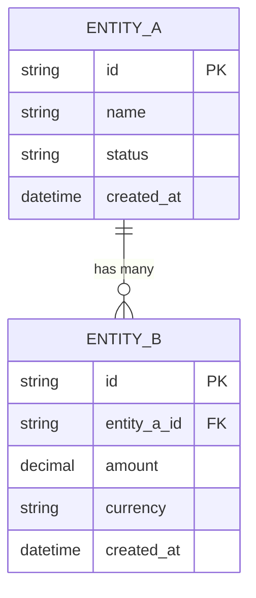

# Technical Specification Document

**Document ID:** TSD-[SYSTEM-IDENTIFIER]-[VERSION]
**Status:** `Draft` | `In Review` | `Approved` | `Superseded`
**Version:** 1.0.0
**Date:** YYYY-MM-DD
**Author(s):** [Name, Role]
**Reviewers:** [Name, Role] | [Name, Role]
**Stakeholder Sign-off:** [Name, Role] - `Pending` | `Approved`

---

## 1. Document Control

| Version | Date | Author | Changes |
| :--- | :--- | :--- | :--- |
| 0.1 | YYYY-MM-DD | [Name] | Initial draft |
| 1.0 | YYYY-MM-DD | [Name] | Approved for implementation |

---

## 2. Executive Summary

> One paragraph. State the system being specified, the business need it addresses, who the primary stakeholders are, and the critical success criteria. A reader should understand the full scope of this document in 60 seconds.

**Example:** This document specifies the requirements for a webhook delivery subsystem integrated into the PayFlow payment gateway. The system must reliably deliver event notifications to merchant-configured endpoints, retry on failure with exponential backoff, support HMAC-SHA256 request signing, and sustain a throughput of 10,000 events per minute at 99.5% delivery success rate.

---

## 3. Scope

### 3.1 In Scope

- [Specific capability 1]
- [Specific capability 2]
- [Specific integration or interface]

### 3.2 Out of Scope

> 🔴 Explicitly stating what is NOT built is as important as what is. This prevents scope creep.

- [Excluded capability 1 - reason: will be addressed in Phase 2]
- [Excluded capability 2 - reason: owned by external system X]

### 3.3 System Boundary

```
[External Actor / System A] --[input/event]--> [ THIS SYSTEM ] --[output/result]--> [External Actor / System B]
```

---

## 4. Definitions and Abbreviations

| Term | Definition |
| :--- | :--- |
| SRS | Software Requirements Specification |
| FR | Functional Requirement |
| NFR | Non-Functional Requirement |
| EARS | Easy Approach to Requirements Syntax |
| [Domain term] | [Plain-language definition] |

---

## 5. Stakeholders

| Stakeholder Class | Representative | Primary Goal | Key Constraint |
| :--- | :--- | :--- | :--- |
| End User | [Description] | [Goal] | [Constraint] |
| System Operator | [Description] | [Goal] | [Constraint] |
| External Integrator | [Description] | [Goal] | [Constraint] |
| Compliance / Regulatory | [Description] | [Goal] | [Constraint] |

---

## 6. EARS Syntax Reference

> All requirements in this document use Easy Approach to Requirements Syntax (EARS). Below are the four patterns with examples.

| Pattern | Template | Example |
| :--- | :--- | :--- |
| **Ubiquitous** | The `<system>` shall `<action>`. | The webhook system shall retry failed deliveries up to 3 times. |
| **Event-driven** | When `<event>`, the `<system>` shall `<action>`. | When a payment succeeds, the system shall send a webhook notification within 30 seconds. |
| **Conditional** | Where `<condition>`, the `<system>` shall `<action>`. | Where the merchant account is in sandbox mode, the system shall not charge real instruments. |
| **State-driven** | While `<state>`, the `<system>` shall `<action>`. | While the delivery status is `retrying`, the system shall apply exponential backoff. |

---

## 7. Functional Requirements

> Each requirement uses EARS syntax. Assign a unique FR-XXX ID. Every FR must have at least one verifiable acceptance criterion.

### 7.1 [Feature / Subsystem Name]

#### FR-001: [Requirement Name]

**Statement:** When `[trigger event]`, the system shall `[action/behavior]`.

**Rationale:** [Why this is required - link to business need or stakeholder goal]

**Acceptance Criteria:**
- `GIVEN` [precondition] `WHEN` [action] `THEN` [expected outcome]
- `GIVEN` [edge case precondition] `WHEN` [action] `THEN` [expected outcome]

**Priority:** `Must Have` | `Should Have` | `Could Have` | `Won't Have`
**Owner:** [Stakeholder class]

---

#### FR-002: [Requirement Name]

**Statement:** The `<system>` shall `<action>`.

**Rationale:** [Reason]

**Acceptance Criteria:**
- `GIVEN` [...] `WHEN` [...] `THEN` [...]

**Priority:** `Must Have`
**Owner:** [Stakeholder class]

---

> 🔵 Open Question: [Unresolved requirement that needs stakeholder clarification before implementation]

### 7.2 [Next Feature / Subsystem]

#### FR-010: [Requirement Name]

[Follow the same structure as above]

---

## 8. Non-Functional Requirements

> Every NFR must be measurable. "The system shall be fast" is not a valid NFR. "The system shall respond to 99th percentile API requests within 200ms" is.

### 8.1 Performance

#### NFR-001: Response Latency

**Statement:** The system shall process and respond to [operation type] requests within `[X]ms` at the `[P99]` percentile under a load of `[N]` concurrent users.

**Acceptance Criterion:** Load test confirms p99 latency ≤ `Xms` at `N` concurrent users.

---

#### NFR-002: Throughput

**Statement:** The system shall sustain a throughput of at least `[N]` requests/events per second/minute under steady-state load without degradation.

**Acceptance Criterion:** Sustained load test at `N` RPS for 10 minutes with < 0.1% error rate.

---

### 8.2 Scalability

#### NFR-010: Horizontal Scale

**Statement:** The system shall scale horizontally by adding instances without requiring application code changes or downtime.

**Acceptance Criterion:** Adding `N` additional instances results in proportional throughput increase (linear scaling within 15% variance).

---

### 8.3 Availability and Reliability

#### NFR-020: Uptime SLA

**Statement:** The system shall maintain `[X]%` uptime measured on a monthly rolling basis, excluding scheduled maintenance windows.

**Acceptance Criterion:** Monitoring confirms uptime ≥ `X`% in any 30-day period.

---

#### NFR-021: MTTR

**Statement:** The Mean Time To Recovery (MTTR) from any single-component failure shall not exceed `[N] minutes`.

**Acceptance Criterion:** Chaos engineering test confirms recovery within `N` minutes for [failure scenario].

---

### 8.4 Security

#### NFR-030: Authentication

**Statement:** All API endpoints exposed by this system shall require `[authentication mechanism - e.g., JWT Bearer token / API Key / mTLS]`. Unauthenticated requests shall be rejected with HTTP 401.

**Acceptance Criterion:** Pen-test confirms no endpoint is accessible without valid credentials.

---

#### NFR-031: Data Encryption

**Statement:** All data transmitted between system components shall use TLS 1.2 or higher. All sensitive data at rest shall be encrypted using AES-256.

**Acceptance Criterion:** Security scan confirms no plaintext transmission; storage encryption verified by auditing key management config.

---

#### NFR-032: Input Validation

**Statement:** The system shall validate and sanitize all inputs at the system boundary. Malformed or oversized inputs shall be rejected with HTTP 400 before processing.

**Acceptance Criterion:** OWASP ZAP scan returns zero high-severity injection findings.

---

### 8.5 Compliance

#### NFR-040: [Regulatory Standard - e.g., PCI-DSS, GDPR, HIPAA]

**Statement:** The system shall comply with `[Standard Name vX.X]` requirements, specifically: `[List specific controls - e.g., PCI-DSS Requirement 6.4: secure code review before production]`.

**Acceptance Criterion:** [Compliance audit, penetration test, certification]

---

### 8.6 Maintainability

#### NFR-050: Observability

**Statement:** The system shall emit structured logs (JSON format) for every request/event processed, including: timestamp, request ID, operation type, duration, outcome (success/error), and error code if applicable.

**Acceptance Criterion:** All log fields present in 100% of sampled log entries during integration testing.

---

## 9. External Interface Requirements

### 9.1 APIs Consumed (Dependencies)

| System | Interface Type | Purpose | Data Format | Auth Method |
| :--- | :--- | :--- | :--- | :--- |
| [External System A] | REST / gRPC / Event | [Why] | JSON / Protobuf | [API Key / OAuth2] |

### 9.2 APIs Provided (Exposed)

| Endpoint / Topic | Interface Type | Consumers | Data Format | Auth Method |
| :--- | :--- | :--- | :--- | :--- |
| [Endpoint] | REST / gRPC / Event | [Who calls it] | JSON | [JWT] |

---

## 10. Data Requirements

### 10.1 Data Inputs

| Data Entity | Source | Format | Volume | Frequency |
| :--- | :--- | :--- | :--- | :--- |
| [Entity name] | [Source system] | [JSON/CSV] | [N records] | [Per request/daily] |

### 10.2 Data Outputs

| Data Entity | Destination | Format | Retention | Privacy Classification |
| :--- | :--- | :--- | :--- | :--- |
| [Entity name] | [Destination] | [JSON/DB] | [30 days] | `Public` / `Internal` / `Confidential` / `Restricted` |

### 10.3 Data Retention and Deletion

- Records of type `[X]` shall be retained for `[N days/years]` per `[policy/regulation]`.
- On user deletion request, `[which data]` shall be purged within `[N hours]` per GDPR Article 17.

---

## 11. Data Model

> Document the logical data model using an ERD. Each entity must have its key attributes and relationships defined.

### 11.1 Entity-Relationship Diagram



### 11.2 Entity Summary

| Entity | Description | Sensitivity | Retention |
| :--- | :--- | :--- | :--- |
| [Entity A] | [What it represents] | `Confidential` / `Internal` / `Public` | [N days/years] |

---

## 12. Error Handling

### 12.1 Error Code Taxonomy

> Every error the system can produce must have a unique, documented code.

| Error Code | HTTP Status | Category | Description | Retryable? |
| :--- | :--- | :--- | :--- | :--- |
| `VALIDATION_FAILED` | 422 | Client | Request body failed field validation | No |
| `RESOURCE_NOT_FOUND` | 404 | Client | Requested resource does not exist | No |
| `RATE_LIMIT_EXCEEDED` | 429 | Client | Too many requests | Yes (after Retry-After) |
| `EXTERNAL_SERVICE_UNAVAILABLE` | 502 | Dependency | Upstream service returned error | Yes (exponential backoff) |
| `INTERNAL_ERROR` | 500 | Server | Unexpected server fault | Yes (with backoff) |

### 12.2 Error Response Format (RFC 7807)

All error responses must follow this schema:

```json
{
  "type": "https://errors.[domain].com/[error-code]",
  "title": "[Human-readable short description]",
  "status": 422,
  "detail": "[Longer description of what went wrong and how to fix it]",
  "instance": "/v1/[resource]/[id]",
  "request_id": "req_[unique-id]",
  "errors": [
    { "field": "[field_name]", "code": "[validation_code]", "message": "[Description]" }
  ]
}
```

### 12.3 Retry Policies

| Error Category | Max Retries | Backoff Strategy | Max Wait | Dead-Letter |
| :--- | :--- | :--- | :--- | :--- |
| Transient (502, 503, timeout) | 3 | Exponential with jitter | 30 seconds | Yes - move to DLQ |
| Rate limit (429) | 3 | Respect `Retry-After` header | 60 seconds | No - retry later |
| Client error (4xx) | 0 | N/A | N/A | No - return to caller |

---

## 13. API Design Standards

> Apply when the system exposes or consumes APIs.

### 13.1 Naming Conventions

| Rule | Correct | Incorrect |
| :--- | :--- | :--- |
| Resources are plural nouns | `/payments`, `/merchants` | `/payment`, `/getPayment` |
| Use kebab-case for multi-word paths | `/payment-links` | `/paymentLinks` |
| HTTP methods are the verbs | `POST /payments` | `POST /create-payment` |

### 13.2 Versioning Strategy

**Strategy:** `URI Versioning` | `Header Versioning`

**Version lifecycle:**
1. New version introduced alongside old
2. Old version marked deprecated with `Deprecation` and `Sunset` headers
3. Minimum support window: [N months] after successor is GA
4. Old version removed after sunset date

### 13.3 Pagination

Every list endpoint must be paginated:

| Parameter | Type | Default | Max | Description |
| :--- | :--- | :--- | :--- | :--- |
| `page` | integer | 1 | - | Page number (1-indexed) |
| `per_page` | integer | 20 | 100 | Records per page |

---

## 14. Migration / Backward Compatibility

> Apply when the system replaces or integrates with an existing system.

### 14.1 Data Migration

| Source Entity | Target Entity | Transformation | Validation Criteria |
| :--- | :--- | :--- | :--- |
| [Source table/file] | [Target table/entity] | [Mapping rules] | [How to verify correctness] |

### 14.2 Backward Compatibility

| Existing Contract | Compatibility Requirement | Window | Deprecation Plan |
| :--- | :--- | :--- | :--- |
| [API endpoint / data format] | [What must remain compatible] | [Duration] | [How deprecated] |

### 14.3 Cutover Strategy

**Approach:** `Parallel Run` | `Canary` | `Big-Bang`

**Rollback procedure:** [Steps to revert if migration fails]

---

## 15. Monitoring and Alerting Requirements

### 15.1 Metrics

| Metric | Source | Threshold | Alert Severity |
| :--- | :--- | :--- | :--- |
| Request rate (RPS) | Load balancer / app | > [N] RPS sustained | P3 - Warning |
| Error rate (5xx) | Application logs | > [X]% over 5 min | P1 - Critical |
| p99 latency | APM | > [X]ms over 5 min | P2 - High |
| Queue depth | Queue monitor | > [N] messages | P2 - High |
| DB connection pool utilization | Database metrics | > 80% | P2 - High |

### 15.2 SLOs / SLIs

| SLI | SLO Target | Error Budget (30-day) | Breach Action |
| :--- | :--- | :--- | :--- |
| Availability (% non-5xx responses) | [X]% | [N] minutes downtime | Freeze non-critical deploys |
| Latency (p99 response time) | < [X]ms | [N] minutes above threshold | Performance investigation |

### 15.3 Dashboards

| Dashboard | Audience | Key Panels |
| :--- | :--- | :--- |
| Operational | On-call engineer | Request rate, error rate, latency, queue depth, DB connections |
| Business | Product / Stakeholder | Transaction volume, success rate, revenue impact |

---

## 16. Test Case Specification

> Every requirement (FR-XXX, NFR-XXX) must map to at least one test case.

| Test Case ID | Linked Requirement | Type | Preconditions | Steps | Expected Result | Status |
| :--- | :--- | :--- | :--- | :--- | :--- | :--- |
| TC-001 | FR-001 | Integration | [Precondition] | 1. [Step] 2. [Step] | [Observable outcome] | `Planned` |
| TC-002 | NFR-001 | Performance | [Precondition] | 1. [Load test setup] 2. [Run] | p99 <= [X]ms at [N] concurrent | `Planned` |
| TC-003 | NFR-030 | Security | [Precondition] | 1. [Pen-test step] 2. [Step] | Zero high-severity findings | `Planned` |

---

## 17. Constraints

| Constraint Type | Description | Rationale |
| :--- | :--- | :--- |
| Technology | [e.g., Must be implemented in PHP 8.3+] | [Existing ecosystem] |
| Platform | [e.g., Must run on Linux x86-64 containers] | [Infrastructure constraint] |
| Regulatory | [e.g., Data must not leave the EU] | [GDPR data residency] |
| Budget | [e.g., Infrastructure cost must not exceed $X/month at baseline load] | [Finance constraint] |

---

## 18. Assumptions

> 🔶 All assumptions here must be validated before implementation begins.

| ID | Assumption | Impact if Wrong | Owner | Status |
| :--- | :--- | :--- | :--- | :--- |
| ASM-001 | [Assumption text] | [Impact description] | [Person] | `Unvalidated` |

---

## 19. Dependencies

| Dependency | Type | Blocking? | Owner | Expected By |
| :--- | :--- | :--- | :--- | :--- |
| [System / Team / Decision] | Internal / External | Yes / No | [Name] | [Date] |

---

## 20. Open Questions

> 🔵 These must be resolved before the specification is considered complete.

| ID | Question | Raised By | Target Resolution Date | Decision |
| :--- | :--- | :--- | :--- | :--- |
| OQ-001 | [Question text] | [Name] | YYYY-MM-DD | `Pending` |

---

## 21. Traceability Matrix

| Requirement ID | Description | Linked Test Case(s) | Linked Design Section | Constraint Type | Status |
| :--- | :--- | :--- | :--- | :--- | :--- |
| FR-001 | [Short description] | TC-001, TC-002 | [Blueprint Section X] | - | `Not Started` |
| NFR-001 | [Short description] | TC-010 | [Blueprint Section Y] | `hard` / `soft` | `Not Started` |

---

## 22. Sign-off

| Role | Name | Signature / Approval | Date |
| :--- | :--- | :--- | :--- |
| Engineering Lead | | | |
| Product Manager | | | |
| Security | | | |
| Architecture | | | |
