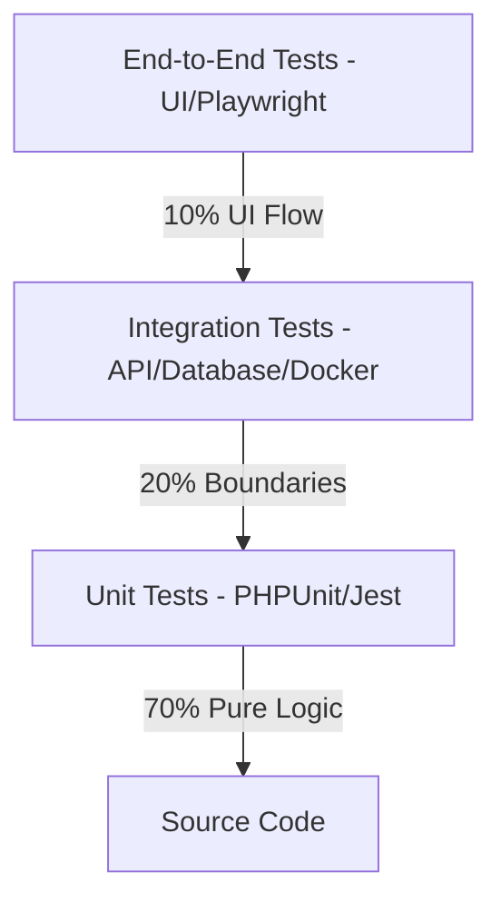
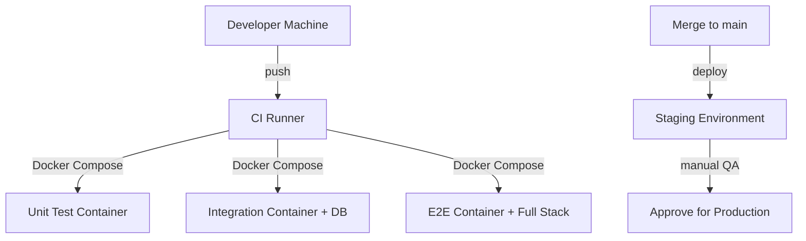

# Test Strategy & QA Plan

**Product Name:** [Product / Service Name]
**Document ID:** TEST-[IDENTIFIER]-[VERSION]
**Status:** `Draft` | `In Review` | `Approved`
**Version:** v1.0.0
**Date:** YYYY-MM-DD
**Author(s):** [Name, QA Engineer / Lead Developer]
**Reviewers:** [Name, Role]

---

## 1. Overview & Quality Objectives

### 1.1 Purpose
[Describe the purpose of this test strategy in 2-3 sentences. What application or component is being tested, and what are the specific stability goals?]

### 1.2 Quality Gates & Target Metrics
Define the quantitative thresholds that must be met before code can be merged to main or deployed:

| Metric | Target | Enforced By |
| :--- | :--- | :--- |
| **Unit Test Coverage** | [e.g., 80% on core logic] | PHPUnit / Jest coverage report gate |
| **Mutation Testing (MSI)** | [e.g., 65% Mutation Score] | Infection PHP / Stryker gate |
| **Static Analysis** | Zero issues at Level [e.g., 9] | PHPStan / ESLint CI check |
| **API Compliance** | 100% endpoint pass | Dredd / Schemathesis contracts check |
| **E2E Success Rate** | 100% critical user paths | Playwright / Cypress execution |

---

## 2. Testing Levels & Toolchain



### 2.1 Unit Testing Layer
- **Focus**: Pure functions, entity business rules, helper utilities, state machine changes.
- **Execution Speed**: < 10ms per test.
- **Mocking Policy**: 100% isolated. No database connections, no HTTP calls. All external services are mocked using native test double frameworks.
- **Run Trigger**: Local save / pre-commit hook.

### 2.2 Integration Testing Layer
- **Focus**: Database repositories, database migrations, controllers, request middlewares, file storage boundaries.
- **Execution Speed**: < 200ms per test.
- **Data Isolation**: Uses a clean, isolated test database wrapper. Database transactions are started before each test and **rolled back** immediately after execution (no persistent DB contamination).
- **Run Trigger**: Pull request updates / CI build.

### 2.3 End-to-End (E2E) Testing Layer
- **Focus**: Page navigation, javascript states, checkout flows, authentication redirects, cross-browser compatibility.
- **Execution Speed**: 2s to 10s per test run.
- **Environment**: Executed against a dedicated, fresh Staging/Local-Docker environment.
- **Run Trigger**: Nightly cron / Release candidate deploy.

---

## 3. Mocking & Staging Integrations

### 3.1 Mocking Matrix (Internal vs. External)

| Integration / API | Mocking Strategy | Tooling / Sandbox Endpoint |
| :--- | :--- | :--- |
| [e.g. Bank Payment API] | Contract Mocking in local tests; Sandbox API in Staging | [e.g. WireMock / sandbox.bank.com] |
| [e.g. SMS Gateway] | Stub outbound response in unit tests; Fake SMS provider | [e.g. Twilio Mock Interface / Local Log] |
| [e.g. SMTP Server] | Mock Mailer wrapper in unit; Catch-all server in Staging | [e.g. Mailhog / Mailpit container] |

### 3.2 Database Setup & Rollbacks
- **Local Dev Database**: Developers run an isolated database instance.
- **Testing Database**: CI spins up a lightweight MariaDB/PostgreSQL container.
- **Rollback Process**:
```php
// Example database transaction rollback per test
public function setUp(): void {
    parent::setUp();
    $this->db->beginTransaction();
}

public function tearDown(): void {
    $this->db->rollBack();
    parent::tearDown();
}
```

---

## 4. Performance Testing

| Test Type | Tool | Load Profile | Thresholds | Frequency |
| :--- | :--- | :--- | :--- | :--- |
| **Load test** | [e.g., k6] | [e.g., 500 concurrent users, 10 min] | [e.g., p95 < 200ms, error rate < 0.1%] | [e.g., Nightly] |
| **Stress test** | [e.g., k6] | [e.g., 2000 concurrent users, 5 min] | [e.g., System degrades gracefully, no crash] | [e.g., Release candidate] |
| **Soak test** | [e.g., k6] | [e.g., 200 concurrent users, 4 hours] | [e.g., No memory leaks, stable latency] | [e.g., Weekly] |
| **Spike test** | [e.g., k6] | [e.g., 0 → 1000 users in 30 seconds] | [e.g., Recovery within 60 seconds] | [e.g., Release candidate] |

**Pass/Fail gate:** [e.g., Load test must pass before merge to main. Failure blocks deployment.]

---

## 5. Contract Testing

| Integration | Consumer | Provider | Tool | Verification Frequency |
| :--- | :--- | :--- | :--- | :--- |
| [e.g., Payment API] | [e.g., Checkout service] | [e.g., Payment service] | [e.g., Pact] | [e.g., Every PR on both sides] |
| [e.g., Public API] | [e.g., External consumers] | [e.g., API gateway] | [e.g., Dredd + OpenAPI spec] | [e.g., Every PR] |

**Breaking change policy:** [e.g., Any contract change requires a version bump and migration guide. CI fails if consumer contract is violated.]

---

## 6. Test Data Management

| Data Type | Strategy | Tool | Isolation |
| :--- | :--- | :--- | :--- |
| **Unit test data** | [e.g., Fixtures — static JSON/YAML] | [e.g., Test loader] | [e.g., Loaded per test file] |
| **Integration test data** | [e.g., Factories — programmatic generation] | [e.g., factory_boy / Faker] | [e.g., Transactional rollback per test] |
| **E2E test data** | [e.g., Seeded database snapshot] | [e.g., Seed script in Docker entrypoint] | [e.g., Fresh container per run] |
| **Staging / demo data** | [e.g., Anonymized production snapshot] | [e.g., Custom anonymization script] | [e.g., Refreshed weekly] |

**Sensitive data policy:** [e.g., No real PII, credentials, or payment data in any test environment. Synthetic data generators only.]

---

## 7. Security Scanning Gates

| Scan Type | Tool | What It Catches | CI Gate Severity | Frequency |
| :--- | :--- | :--- | :--- | :--- |
| **SAST** | [e.g., Semgrep] | [e.g., SQL injection, XSS, insecure crypto] | [e.g., Block on High/Critical] | [e.g., Every PR] |
| **DAST** | [e.g., OWASP ZAP] | [e.g., Runtime vulnerabilities, misconfigurations] | [e.g., Block on High/Critical] | [e.g., Nightly / release candidate] |
| **Dependency scan** | [e.g., Snyk / Dependabot] | [e.g., Known CVEs in dependencies] | [e.g., Block on Critical, warn on High] | [e.g., Every PR + daily] |
| **Secrets detection** | [e.g., TruffleHog] | [e.g., Committed API keys, passwords] | [e.g., Block unconditionally] | [e.g., Every commit] |

---

## 8. Acceptance Test Scenarios (Gherkin BDD)

> Define the critical user pathways using Given-When-Then criteria. These scenarios guide manual verification and E2E script development.

### 8.1 Scenario 1: [Name of Core Path - e.g. Customer Checkout]
* **Given** [the starting environment state]
* **And** [additional preconditions]
* **When** [the user executes the target action]
* **Then** [the expected UI state occurs]
* **And** [the database ledger entries balance]

### 8.2 Scenario 2: [Name of Edge Case - e.g. Payment Timeout]
* **Given** [state of system]
* **When** [network disconnects or action fails]
* **Then** [system handles error gracefully and prompts retry]

---

## 9. Flaky Test Handling Policy

| Rule | Threshold | Action |
| :--- | :--- | :--- |
| **Flaky detection** | [e.g., 3 consecutive flaky failures on same code] | [e.g., Auto-move to quarantine suite] |
| **Retry limit** | [e.g., 2 retries per test in CI] | [e.g., Pass on retry = flagged, not blocked] |
| **Resolution SLA** | [e.g., 2 weeks in quarantine] | [e.g., Fix or delete — no permanent quarantine] |
| **Quarantine reporting** | [e.g., Weekly quarantine count report] | [e.g., Increasing trend = infrastructure investigation] |

**Quarantine suite location:** [e.g., `tests/quarantine/` — runs in separate CI job, does not block main pipeline]

---

## 10. Test Environment Architecture



| Environment | Provisioned By | Data Strategy | Lifespan | Mirror of Production |
| :--- | :--- | :--- | :--- | :--- |
| **Local dev** | Docker Compose | [e.g., Factory-generated fixtures] | [e.g., Persistent] | [e.g., Close — same Docker images] |
| **CI** | Docker Compose (ephemeral) | [e.g., Factories + seed script] | [e.g., Per-run, destroyed after] | [e.g., Close — same images, smaller data] |
| **Staging** | [e.g., Terraform / Helm] | [e.g., Anonymized production snapshot] | [e.g., Persistent, refreshed weekly] | [e.g., Yes — same infra, same data shape] |
| **Production** | [e.g., Terraform / Helm] | [e.g., Real data] | [e.g., Permanent] | [N/A — this is production] |

---

## 11. CI/CD Test Runner Runsheet

This runsheet specifies the exact commands run by the CI system on every Pull Request to enforce code quality gates.

```yaml
# GitHub Actions / GitLab CI Job configuration snippet
name: Quality Verification

on: [push, pull_request]

jobs:
  verify:
    runs-on: ubuntu-latest
    steps:
      - name: Checkout Codebase
        uses: actions/checkout@v6

      - name: Setup PHP Environment
        uses: actions/setup-node@v6 # Or setup-php / setup-python depending on stack
        with:
          node-version: '24'

      - name: Validate Dependencies
        run: [e.g. npm ci / composer validate]

      - name: Static Analysis
        run: [e.g. npm run lint / phpstan analyse]

      - name: Run Unit Tests
        run: [e.g. npm run test:unit / phpunit --testsuite=Unit]

      - name: Run Integration Tests
        run: [e.g. npm run test:integration / phpunit --testsuite=Integration]
```
