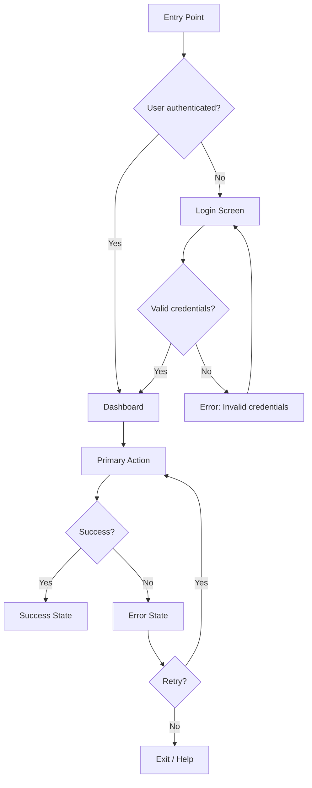

# UX Flow Specification

**Product / Feature:** [Name]
**Document ID:** UXF-[IDENTIFIER]-[VERSION]
**Status:** `Draft` | `In Review` | `Approved`
**Version:** 1.0.0
**Date:** YYYY-MM-DD
**Author(s):** [Name, Role]
**Reviewers:** [Name, Role]
**Related Documents:** [design-system-specification, user-personas-behavior]

---

## 1. Overview

### 1.1 Purpose

[2-3 sentences: what flow(s) does this document cover, and what primary user task(s) do they serve?]

### 1.2 Primary Task(s)

| Task | User Goal | Entry Point(s) |
| :--- | :--- | :--- |
| [e.g., Complete signup] | [Get to a usable account] | [Landing page CTA, invite link] |

---

## 2. Information Architecture

```
[Site map - indent to show nesting]
Home
├── Dashboard
│   ├── Settings
│   └── Reports
├── Onboarding
│   ├── Sign Up
│   ├── Verify Email
│   └── First-Run Setup
```

---

## 3. User Journey: [Journey Name]

> Narrative, end-to-end. Cross-session steps are fine here - screen-level detail comes in Section 4.

[e.g., "A new user discovers the product via a landing page, signs up with email, verifies via a 6-digit code sent by email, sets a password, and lands on an empty dashboard prompting their first action."]

---

## 4. Screen-by-Screen Flow

### Screen: [Name - e.g., "Sign Up"]

**Entry point(s):** [How a user arrives here]
**Primary action:** [What the user does on this screen]

| State | What the User Sees | Available Actions |
| :--- | :--- | :--- |
| Loading | [e.g., Skeleton form / spinner] | [None / Cancel] |
| Empty | [N/A for this screen, or describe] | |
| Error | [e.g., "Email already in use" inline, field preserved] | [Retry, switch to login] |
| Success / Populated | [e.g., Form with email + password fields] | [Submit, navigate to Login] |

**Exit points:** [Where each action leads - e.g., Submit → Verify Email screen; "Already have an account?" → Login screen]

*(Repeat this screen block for every screen in the flow.)*

---

## 5. Flow Diagram

> Visual representation of the flow using Mermaid. Show the primary path and key branching points.



*(Customize per flow. Include decision points, error branches, and recovery loops.)*

---

## 6. Responsive Behavior

| Breakpoint | Layout Change | Hidden Elements | Touch Adaptations |
| :--- | :--- | :--- | :--- |
| **Desktop** (≥1024px) | [e.g., Full sidebar + main content] | [None] | [N/A] |
| **Tablet** (768-1023px) | [e.g., Collapsible sidebar, stacked content] | [e.g., Secondary nav items in menu] | [e.g., Larger touch targets] |
| **Mobile** (<768px) | [e.g., Single column, bottom nav] | [e.g., Decorative elements, secondary CTAs] | [e.g., Swipe gestures, thumb-zone placement] |

**Cross-device state:** [What state is preserved if a user switches devices mid-flow? e.g., Form draft saved to account]

---

## 7. Error Taxonomy

| Error Type | Example Scenario | User Message | Recovery Action |
| :--- | :--- | :--- | :--- |
| **Network** | [e.g., Connection lost during save] | "Unable to connect. Check your connection and try again." | [Retry button, auto-retry with backoff] |
| **Validation** | [e.g., Invalid email format] | [Inline: "Enter a valid email address"] | [Correct field, resubmit] |
| **Permission** | [e.g., Non-admin tries to delete] | "You don't have permission to do this." | [Contact admin link] |
| **Server** | [e.g., 500 error on submit] | "Something went wrong on our end." | [Retry, status page link] |
| **Not Found** | [e.g., Deleted resource accessed] | "This [item] couldn't be found." | [Navigate back, search] |
| **Conflict** | [e.g., Concurrent edit detected] | "This was modified by someone else." | [Show diff, choose version] |

---

## 8. Confirmation Patterns

| Action | Pattern | Implementation | Reversible? |
| :--- | :--- | :--- | :--- |
| [e.g., Delete item] | Confirmation modal | [Modal with action name + consequence + "Delete" / "Cancel"] | `No` — requires confirmation |
| [e.g., Archive item] | Undo toast | [Toast with "Undo" button, 8-second auto-dismiss] | `Yes` — undo available |
| [e.g., Delete organization] | Double confirmation | [Type organization name to confirm] | `No` — catastrophic |
| [e.g., Send invitation] | Inline confirmation | [Brief "Sent" toast, no blocking dialog] | `Yes` — can revoke later |

---

## 9. Notification Patterns

| Pattern | Use Case | Duration | Dismissable | Position |
| :--- | :--- | :--- | :--- | :--- |
| **Toast** | [e.g., "Report saved"] | 5s auto-dismiss | Yes | Bottom-right |
| **Banner** | [e.g., "Scheduled maintenance in 2 hours"] | Until resolved | Yes (if non-critical) | Top of page |
| **In-app notification** | [e.g., "You have 3 pending approvals"] | Until read | Yes | Bell icon / notification center |
| **Inline message** | [e.g., "Complete your profile to continue"] | Persistent | No (must act) | Adjacent to relevant element |

---

## 10. State Management

| Concern | Behavior | Notes |
| :--- | :--- | :--- |
| **Form persistence** | [e.g., Draft auto-saved to localStorage every 30s] | [What happens on browser refresh?] |
| **Undo support** | [e.g., Last 3 actions undoable via Ctrl+Z or toast button] | [Which actions support undo?] |
| **Offline behavior** | [e.g., Read-only cached content; write actions queue for sync] | [What fails immediately vs queues?] |
| **Stale data** | [e.g., Cache invalidated after 5 min or on focus] | [When does cached data expire?] |

---

## 11. Edge Cases and Recovery Paths

| Scenario | Trigger | Behavior | Recovery Path |
| :--- | :--- | :--- | :--- |
| [e.g., Expired verification code] | [Code older than 15 min] | [Inline error, "Resend code" button shown] | [User can request new code without restarting signup] |
| [e.g., User already has account] | [Email exists in system] | [Inline message + link] | [Redirect to login with email pre-filled] |

> No scenario in this table should result in a dead end (a screen with no way forward, back, or recovery).

---

## 12. Accessibility Notes

| Screen | Keyboard/Tab Order | Focus Management | Completable Without Mouse? |
| :--- | :--- | :--- | :--- |
| [Sign Up] | [Email → Password → Submit] | [Focus moves to first error field on validation failure] | `Yes` |

---

## 13. Open Questions

| Question | Status | Owner |
| :--- | :--- | :--- |
| [e.g., Should social login be supported at launch?] | `Open` / `Resolved` | [Name] |
